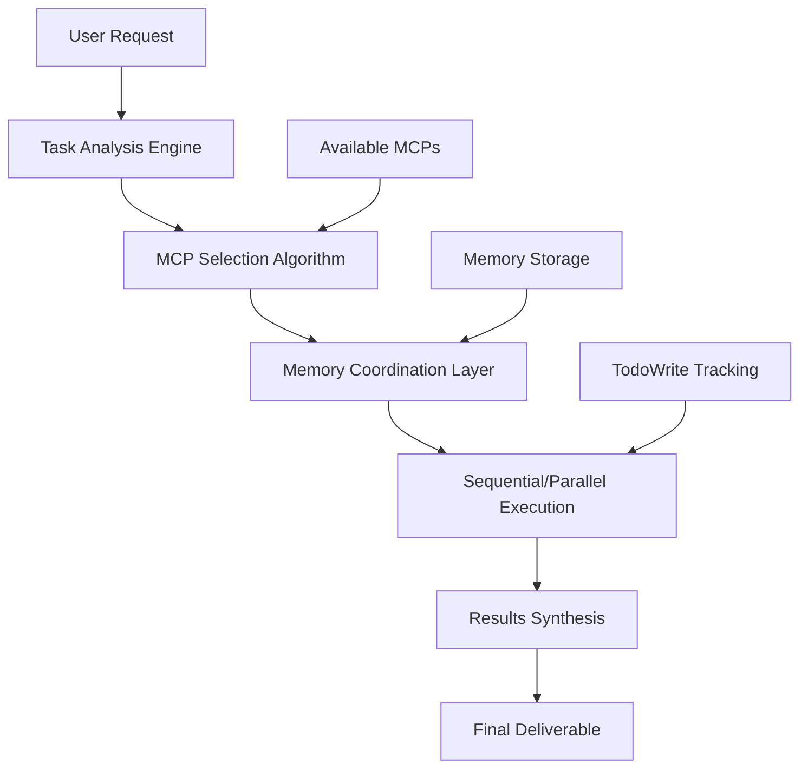

# Claude-Flow MCP Orchestration System

## Overview

Claude-Flow acts as an intelligent orchestrator that automatically discovers, selects, and coordinates multiple MCP (Model Context Protocol) servers to handle complex tasks. This document explains how the system works and provides practical examples.

## Architecture Overview



## MCP Discovery & Calling Mechanism

### 1. MCP Server Detection

Claude-flow automatically detects available MCP servers through the `mcp__` prefix pattern:

```javascript
// MCP Discovery Process
const availableMCPs = {
    financial: ['mcp__trader__analyze_stock', 'mcp__trader__analyze_crypto', 'mcp__trader__position_size'],
    code: ['mcp__serena__find_symbol', 'mcp__serena__replace_symbol_body', 'mcp__nia__lookup_codebase_context'],
    web: ['mcp__playwright__browser_navigate', 'mcp__browser-tools__takeScreenshot'],
    research: ['mcp__tavily__tavily-search', 'mcp__context7__get-library-docs'],
    coordination: ['mcp__zen__*']
};
```

### 2. Tool Function Mapping

Each MCP server exposes specific functions that claude-flow can call directly:

```yaml
Trader MCP:
  - mcp__trader__analyze_stock(symbol)
  - mcp__trader__analyze_crypto(symbol, provider, lookback_days)
  - mcp__trader__relative_strength(symbol, benchmark)
  - mcp__trader__position_size(symbol, stop_price, risk_amount, account_size)

Serena MCP:
  - mcp__serena__find_symbol(name_path, relative_path)
  - mcp__serena__replace_symbol_body(name_path, relative_path, body)
  - mcp__serena__search_for_pattern(substring_pattern)

NIA MCP:
  - mcp__nia__lookup_codebase_context(user_query)

Playwright MCP:
  - mcp__playwright__browser_navigate(url)
  - mcp__playwright__browser_click(element, ref)
  - mcp__playwright__browser_take_screenshot()

Tavily MCP:
  - mcp__tavily__tavily-search(query, max_results)
  - mcp__tavily__tavily-extract(urls)
```

## Task Classification Algorithm

### Classification Logic

```python
def classify_and_select_mcps(user_request):
    """
    Analyzes user request and selects appropriate MCP servers
    """
    request_lower = user_request.lower()
    selected_mcps = []
    
    # Financial Analysis Detection
    financial_keywords = ['stock', 'crypto', 'trading', 'market', 'price', 'analysis', 'portfolio']
    if any(keyword in request_lower for keyword in financial_keywords):
        selected_mcps.extend(['trader'])
    
    # Code Development Detection  
    code_keywords = ['code', 'function', 'debug', 'implement', 'refactor', 'class', 'method']
    if any(keyword in request_lower for keyword in code_keywords):
        selected_mcps.extend(['serena', 'nia'])
    
    # Web/UI Detection
    web_keywords = ['website', 'browser', 'test', 'ui', 'screenshot', 'automation']
    if any(keyword in request_lower for keyword in web_keywords):
        selected_mcps.extend(['playwright', 'browser-tools'])
    
    # Research Detection
    research_keywords = ['research', 'find', 'search', 'analyze', 'compare', 'documentation']
    if any(keyword in request_lower for keyword in research_keywords):
        selected_mcps.extend(['tavily', 'context7'])
    
    # Complex Coordination Detection
    if len(selected_mcps) > 2:
        selected_mcps.append('zen')
    
    return selected_mcps
```

### Example Classifications

| User Request | Detected Keywords | Selected MCPs |
|-------------|------------------|---------------|
| "Analyze TSLA stock performance" | stock, analyze | trader, tavily |
| "Debug authentication function" | debug, function | serena, nia, tavily |
| "Test login page with automation" | test, automation | playwright, browser-tools |
| "Research React best practices and implement" | research, implement | tavily, serena, nia, zen |

## Memory-Driven Coordination

### Memory Structure

```yaml
sparc_session/
├── task_analysis/
│   ├── original_request: "User's exact request"
│   ├── classified_type: "development|research|financial|testing"
│   ├── selected_mcps: ["mcp1", "mcp2", "mcp3"]
│   └── execution_plan: "Sequential/parallel execution strategy"
│
├── mcp_results/
│   ├── trader/
│   │   ├── stock_analysis: "Technical indicators, price data"
│   │   ├── risk_assessment: "Position sizing, stop levels"
│   │   └── timestamp: "2025-01-01T10:30:00Z"
│   │
│   ├── serena/
│   │   ├── code_symbols: "Found functions, classes"
│   │   ├── code_changes: "Applied modifications"
│   │   └── analysis_context: "Code understanding"
│   │
│   └── tavily/
│       ├── research_results: "Web search findings"
│       ├── documentation: "External docs, best practices"
│       └── sources: "URLs, references"
│
├── coordination/
│   ├── handoff_data: "Data passed between MCPs"
│   ├── error_handling: "Failed operations, fallbacks"
│   └── dependency_chain: "Execution order, prerequisites"
│
└── synthesis/
    ├── combined_insights: "Integrated findings"
    ├── recommendations: "Next steps, actions"
    └── final_output: "Structured deliverable"
```

### Coordination Patterns

**Sequential Handoff Pattern:**
```javascript
// Research → Analysis → Implementation
Memory.store("research_phase", tavily_results);
const analysis = serena.analyze_based_on(Memory.get("research_phase"));
Memory.store("analysis_phase", analysis);
const implementation = serena.implement_based_on(Memory.get("analysis_phase"));
```

**Parallel Execution Pattern:**
```javascript
// Multiple independent analyses
Promise.all([
    trader.analyze_stock("TSLA"),
    tavily.search("TSLA news"),
    context7.get_financial_docs("technical analysis")
]).then(results => {
    Memory.store("parallel_results", results);
    synthesize_findings(results);
});
```

## Practical Examples

### Example 1: Financial Analysis Workflow

**User Request:** *"Analyze TESLA stock and suggest optimal position sizing for a $10,000 account"*

**Execution Flow:**

```javascript
// Step 1: Task Analysis
TodoWrite([
    {id: "analyze_tsla", content: "Get TSLA technical analysis", status: "pending"},
    {id: "research_news", content: "Find recent TSLA news", status: "pending"},
    {id: "calculate_position", content: "Calculate position size", status: "pending"},
    {id: "synthesize", content: "Combine analysis", status: "pending"}
]);

// Step 2: MCP Orchestration
// Parallel execution for speed
const [technical_analysis, news_research] = await Promise.all([
    mcp__trader__analyze_stock("TSLA"),
    mcp__tavily__tavily_search("TSLA stock news last 7 days", {max_results: 10})
]);

// Store results in memory
Memory.store("sparc_session/trader_analysis", technical_analysis);
Memory.store("sparc_session/news_research", news_research);

// Step 3: Position Sizing (depends on technical analysis)
const position_size = await mcp__trader__position_size(
    "TSLA", 
    technical_analysis.suggested_stop_loss, 
    500, // Risk $500
    10000 // Account size
);

// Step 4: Synthesis
const final_analysis = {
    technical: technical_analysis,
    fundamental: news_research,
    position_sizing: position_size,
    recommendation: synthesize_recommendation([technical_analysis, news_research, position_size])
};

Memory.store("sparc_session/final_analysis", final_analysis);
```

**Expected MCP Calls:**
1. `mcp__trader__analyze_stock("TSLA")` → Technical indicators, support/resistance
2. `mcp__tavily__tavily-search("TSLA stock news last 7 days")` → Recent news impact
3. `mcp__trader__position_size("TSLA", 320, 500, 10000)` → Position sizing calculation

### Example 2: Development Workflow

**User Request:** *"Debug the authentication system and implement OAuth integration"*

**Execution Flow:**

```javascript
// Step 1: Code Discovery
const auth_context = await mcp__nia__lookup_codebase_context(
    "authentication system login oauth integration"
);

Memory.store("sparc_session/codebase_context", auth_context);

// Step 2: Symbol Analysis
const auth_symbols = await mcp__serena__find_symbol(
    "auth", 
    null, // Search entire codebase
    {include_body: true, depth: 2}
);

Memory.store("sparc_session/auth_symbols", auth_symbols);

// Step 3: Research Best Practices
const oauth_research = await mcp__tavily__tavily_search(
    "OAuth 2.0 implementation Node.js Express best practices 2025"
);

Memory.store("sparc_session/oauth_research", oauth_research);

// Step 4: Implementation
const implementation_plan = synthesize_implementation_plan(
    Memory.get("sparc_session/codebase_context"),
    Memory.get("sparc_session/auth_symbols"), 
    Memory.get("sparc_session/oauth_research")
);

// Apply changes using Serena
await mcp__serena__replace_symbol_body(
    "AuthController/login",
    "src/controllers/auth.js",
    implementation_plan.new_login_method
);
```

**Expected MCP Calls:**
1. `mcp__nia__lookup_codebase_context()` → Find auth-related code
2. `mcp__serena__find_symbol("auth")` → Locate auth functions
3. `mcp__tavily__tavily-search("OAuth implementation")` → Research solutions
4. `mcp__serena__replace_symbol_body()` → Apply code changes

### Example 3: Web Testing Workflow

**User Request:** *"Test the checkout process and capture screenshots of any errors"*

**Execution Flow:**

```javascript
// Step 1: Navigate and Test
await mcp__playwright__browser_navigate("https://app.localhost:3000/checkout");

// Step 2: Capture Initial State
const initial_screenshot = await mcp__playwright__browser_take_screenshot({
    filename: "checkout_initial.png"
});

// Step 3: Monitor for Errors
await mcp__browser_tools__wipeLogs(); // Clear previous logs
await mcp__playwright__browser_click("Place Order Button", "#place-order-btn");

// Step 4: Check for Console Errors
const console_errors = await mcp__browser_tools__getConsoleErrors();
const network_errors = await mcp__browser_tools__getNetworkErrors();

if (console_errors.length > 0 || network_errors.length > 0) {
    // Capture error state
    const error_screenshot = await mcp__playwright__browser_take_screenshot({
        filename: "checkout_errors.png"
    });
    
    Memory.store("sparc_session/checkout_errors", {
        console_errors,
        network_errors,
        screenshots: [initial_screenshot, error_screenshot]
    });
}
```

**Expected MCP Calls:**
1. `mcp__playwright__browser_navigate()` → Load checkout page
2. `mcp__playwright__browser_take_screenshot()` → Capture state
3. `mcp__browser_tools__getConsoleErrors()` → Monitor errors
4. `mcp__playwright__browser_click()` → Interact with UI

## TodoWrite Integration

Claude-flow uses TodoWrite to track orchestration progress:

```javascript
// Complex Task Breakdown
TodoWrite([
    {
        id: "task_analysis",
        content: "Analyze request and select appropriate MCPs",
        status: "completed",
        priority: "high"
    },
    {
        id: "mcp_trader_execution",
        content: "Execute trader MCP for financial analysis",
        status: "in_progress", 
        priority: "high"
    },
    {
        id: "mcp_tavily_research",
        content: "Research supporting information via Tavily",
        status: "pending",
        priority: "medium",
        dependencies: ["task_analysis"]
    },
    {
        id: "results_synthesis",
        content: "Synthesize results from all MCPs",
        status: "pending",
        priority: "high",
        dependencies: ["mcp_trader_execution", "mcp_tavily_research"]
    }
]);
```

## Error Handling & Fallbacks

### MCP Failure Recovery

```javascript
async function executeWithFallback(primaryMCP, fallbackMCP, request) {
    try {
        const result = await primaryMCP(request);
        Memory.store(`sparc_session/${primaryMCP.name}_success`, result);
        return result;
    } catch (error) {
        console.log(`${primaryMCP.name} failed, trying ${fallbackMCP.name}`);
        Memory.store(`sparc_session/${primaryMCP.name}_error`, error);
        
        try {
            const fallbackResult = await fallbackMCP(request);
            Memory.store(`sparc_session/${fallbackMCP.name}_fallback_success`, fallbackResult);
            return fallbackResult;
        } catch (fallbackError) {
            Memory.store(`sparc_session/complete_failure`, {
                primary_error: error,
                fallback_error: fallbackError
            });
            throw new Error(`Both ${primaryMCP.name} and ${fallbackMCP.name} failed`);
        }
    }
}
```

### Common Fallback Patterns

| Primary MCP | Fallback Strategy |
|-------------|------------------|
| Trader (API failure) | Use Tavily for financial data |
| Serena (syntax error) | Use NIA for codebase analysis |
| Playwright (browser crash) | Use Browser-Tools for diagnostics |
| Tavily (rate limit) | Use Context7 for documentation |

## Advanced Orchestration Patterns

### Multi-Stage Pipeline

```javascript
// Research → Analysis → Implementation → Testing
const pipeline = [
    {stage: "research", mcps: ["tavily", "context7"]},
    {stage: "analysis", mcps: ["nia", "serena"], dependencies: ["research"]},
    {stage: "implementation", mcps: ["serena"], dependencies: ["analysis"]},
    {stage: "testing", mcps: ["playwright", "browser-tools"], dependencies: ["implementation"]}
];

async function executePipeline(pipeline) {
    for (const stage of pipeline) {
        TodoWrite([{
            id: `stage_${stage.stage}`,
            content: `Execute ${stage.stage} with ${stage.mcps.join(', ')}`,
            status: "in_progress"
        }]);
        
        const stageResults = await Promise.all(
            stage.mcps.map(mcp => executeMCP(mcp, getStageInput(stage)))
        );
        
        Memory.store(`sparc_session/stage_${stage.stage}`, stageResults);
        
        TodoWrite([{
            id: `stage_${stage.stage}`,
            status: "completed"
        }]);
    }
}
```

### Adaptive MCP Selection

```javascript
// Dynamic MCP selection based on results
function adaptMCPSelection(initialResults, originalRequest) {
    const adaptations = [];
    
    // If financial analysis shows high volatility, add risk analysis
    if (initialResults.trader?.volatility > 0.3) {
        adaptations.push({
            mcp: "trader",
            function: "suggest_stops",
            reason: "High volatility detected"
        });
    }
    
    // If code analysis finds security issues, add security research
    if (initialResults.serena?.security_warnings?.length > 0) {
        adaptations.push({
            mcp: "tavily", 
            function: "tavily_search",
            query: "security best practices " + originalRequest,
            reason: "Security issues found"
        });
    }
    
    return adaptations;
}
```

## Configuration & Customization

### MCP Priority Configuration

```yaml
# ~/.claude-flow/mcp-config.yaml
mcp_preferences:
  financial_analysis:
    primary: "trader"
    fallback: "tavily"
    timeout: 30s
    
  code_analysis:
    primary: "serena"
    secondary: "nia"
    fallback: "tavily"
    
  research:
    primary: "tavily"
    secondary: "context7"
    parallel: true
    
  web_testing:  
    primary: "playwright"
    monitoring: "browser-tools"
    screenshot_on_error: true
```

### Custom Orchestration Rules

```javascript
// Custom rule: Always include security analysis for auth-related tasks
const customRules = {
    "authentication": {
        required_mcps: ["serena", "nia"],
        optional_mcps: ["tavily"],
        post_analysis: ["security_audit"],
        memory_retention: "30_days"
    },
    
    "trading_analysis": {
        required_mcps: ["trader"],
        optional_mcps: ["tavily", "context7"],
        risk_assessment: true,
        alerts: ["high_volatility", "position_size_warning"]
    }
};
```

## Best Practices

### 1. Memory Management
- Store all MCP results for cross-reference
- Use structured memory keys for easy retrieval
- Clean up temporary data after synthesis

### 2. Error Resilience
- Always have fallback MCPs
- Store error details for debugging
- Continue with partial results when possible

### 3. Performance Optimization
- Use parallel execution for independent tasks
- Cache frequently accessed data
- Implement MCP response caching

### 4. Security Considerations
- Validate MCP inputs before execution
- Sanitize outputs before storing in memory
- Implement API key rotation for external MCPs

## Troubleshooting

### Common Issues

**MCP Not Found:**
```bash
# Check MCP registration
claude mcp list

# Verify MCP server is running
./claude-flow mcp status
```

**Memory Coordination Failures:**
```javascript
// Debug memory state
Memory.list("sparc_session/*");

// Check for missing dependencies
TodoRead().filter(todo => todo.status === "blocked");
```

**MCP Timeout Issues:**
```yaml
# Increase timeout in config
mcp_timeouts:
  trader: 60s
  tavily: 30s
  playwright: 120s
```

## Conclusion

Claude-flow's MCP orchestration system provides intelligent, automated coordination of multiple AI-powered tools. Through task classification, memory-driven coordination, and adaptive execution strategies, it seamlessly integrates your 8 MCP servers into powerful workflows that handle complex, multi-domain tasks efficiently.

The system's strength lies in its ability to:
- **Automatically detect** which MCPs are needed for any given task
- **Coordinate information flow** between MCPs through memory
- **Handle failures gracefully** with fallback strategies  
- **Synthesize results** from multiple sources into coherent outputs

This orchestration capability transforms your individual MCP servers into a cohesive AI workforce capable of tackling sophisticated challenges across financial analysis, software development, web automation, and research domains.