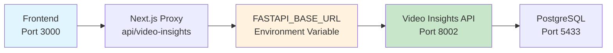

# Port Configuration Guide

## 🚨 Avoiding Port Mismatch Issues

The **port mismatch problem** was the root cause of video insights authentication errors. This guide ensures it never happens again.

## Service Port Map

| Service | Port | Purpose | Health Check |
|---------|------|---------|--------------|
| **Next.js Frontend** | 3000 | Main web application | `/api/health` |
| **Video Insights API** | 8002 | FastAPI backend (Docker) | `/health` |
| **Economic Data API** | 8000 | Python FRED service | `/api/v1/economic/housing/summary` |
| **Python Analytics** | 5001 | Backtrader service | `/health` |
| **PostgreSQL** | 5433 | Database (external: 5433, internal: 5432) | N/A |
| **Redis** | 6379 | Cache & queue | N/A |

## Environment Configuration

### ✅ Correct Configuration
```bash
# .env.local
FASTAPI_BASE_URL=http://localhost:8002    # Video Insights API
PYTHON_BACKEND_URL=http://localhost:8000  # Economic Data API  
NODE_ENV=development
```

### ❌ Wrong Configuration That Caused the Problem
```bash
# .env.local (BROKEN)
FASTAPI_BASE_URL=http://localhost:8000    # ❌ Points to wrong service!
```

## Authentication Flow



**The Problem:** If `FASTAPI_BASE_URL` points to the wrong port, authentication requests go to the wrong backend service.

## Quick Validation Commands

### 1. Check All Services
```bash
npm run health-check
```

### 2. Discover Services
```bash
npm run check-services
```

### 3. Manual Validation
```bash
# Test Video Insights API
curl -H "Authorization: dev-token" "http://localhost:8002/api/v1/folders/"

# Test Economic Data API  
curl "http://localhost:8000/api/v1/economic/housing/summary?period=3m"

# Test Frontend
curl "http://localhost:3000/api/health"
```

## Troubleshooting Port Issues

### Issue: "401 Unauthorized" from Video Insights

**Diagnosis:**
```bash
# Check which service is responding
curl -I "$(grep FASTAPI_BASE_URL .env.local | cut -d= -f2)/health"
```

**Solution:**
1. Run service discovery: `npm run check-services`
2. Update `.env.local` with correct port
3. Restart frontend: `npm run dev`

### Issue: "Connection Refused"

**Diagnosis:**
```bash
# Check if Docker services are running
docker compose ps

# Check local Python services
lsof -i -P | grep python | grep LISTEN
```

**Solution:**
1. Start missing Docker services: `docker compose up -d`
2. Or start local services as needed

### Issue: "Wrong Service Responding"

**Symptoms:** Getting responses from unexpected service

**Diagnosis:**
```bash
# Check what's running on suspected port
curl "http://localhost:8002/health" | jq '.service'
curl "http://localhost:8000/health" | jq '.service'
```

**Solution:** Update environment variables to point to correct ports

## Prevention Checklist

- [ ] Run `npm run health-check` before starting development
- [ ] Verify `.env.local` has correct ports for all services
- [ ] Check Docker services are running: `docker compose ps`
- [ ] Test authentication endpoints manually before debugging
- [ ] Use service discovery script when in doubt

## Docker Compose Port Binding

```yaml
# docker-compose.yml
services:
  video-insights-api:
    ports:
      - "8002:8002"  # External:Internal

  postgres:
    ports:
      - "5433:5432"  # External:Internal
```

**Key Point:** Always use the **external port** (left side) in your `.env.local` configuration.

## Service Health Check URLs

```bash
# Video Insights API (Docker)
http://localhost:8002/health
# Expected: {"status":"healthy","database":"connected","service":"YouTube Video Insights API"}

# Economic Data API (Local Python)
http://localhost:8000/api/v1/economic/housing/summary?period=3m
# Expected: {"current_metrics":{...},"time_series":[...],"metadata":{...}}

# Frontend Health
http://localhost:3000/api/health
# Expected: {"status":"ok","timestamp":"..."}
```

## Common Port Conflicts

| Conflict | Cause | Solution |
|----------|-------|----------|
| 8000 vs 8002 | Multiple Python services | Use Docker for video insights (8002), local for economic data (8000) |
| 5432 vs 5433 | PostgreSQL inside/outside Docker | Use 5433 for external connections |
| 3000 duplicate | Multiple Next.js instances | Stop other Next.js processes |

## Emergency Reset

If completely confused about ports:

```bash
# 1. Stop everything
docker compose down
pkill -f "node.*3000"
pkill -f "python.*8000"

# 2. Verify nothing running
lsof -i :3000,8000,8002,5433

# 3. Start fresh
docker compose up -d
npm run dev

# 4. Validate
npm run health-check
```

This ensures a clean slate with known port configuration.