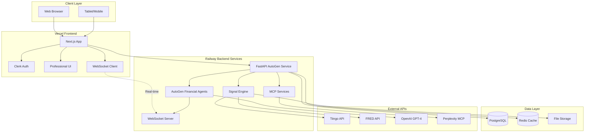
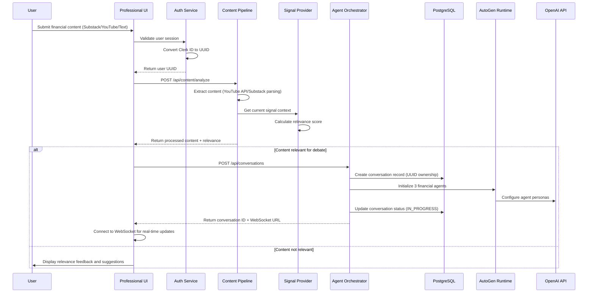
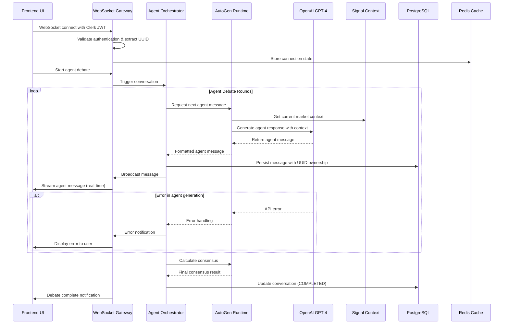

# AutoGen Financial Intelligence Demo Fullstack Architecture Document

## Introduction

This document outlines the complete fullstack architecture for **AutoGen Financial Intelligence Demo**, including backend systems, frontend implementation, and their integration. It serves as the single source of truth for AI-driven development, ensuring consistency across the entire technology stack.

This unified approach combines what would traditionally be separate backend and frontend architecture documents, streamlining the development process for modern fullstack applications where these concerns are increasingly intertwined.

### Starter Template Analysis

**Foundation:** **Sophisticated Brownfield Enhancement** - Building on existing advanced infrastructure

**Existing Strengths Preserved:**
- Domain-driven architecture with `/domains/` structure (ai-agents, trading-signals, market-data, risk-management)
- Professional Clerk authentication and theme management system
- Working signal calculation infrastructure with multiple data sources
- Existing MCP integrations (Perplexity fact-checking, FRED economic data)
- Comprehensive TypeScript implementation and testing framework

**Critical Modernization Areas:**
- Middleware authentication activation (Clerk already configured)
- Infrastructure service restoration (Python backends, API keys)
- AutoGen integration with existing agent framework
- Real-time WebSocket enhancement for agent conversations

**Architectural Constraint:** Preserve all existing functionality while adding AutoGen capabilities within $200/month infrastructure budget for MVP demonstration to Croesus partnership.

### Change Log
| Date | Version | Description | Author |
|------|---------|-------------|---------|
| 2025-01-28 | 1.0 | Modernized architecture based on comprehensive audit | Winston (Architect) |

---

## High Level Architecture

### Technical Summary

The AutoGen Financial Intelligence Demo employs a **modernized brownfield architecture** that enhances existing sophisticated infrastructure with Microsoft AutoGen multi-agent capabilities. The system leverages the current domain-driven monorepo structure with Next.js frontend and multiple Python backend services, adding real-time WebSocket streaming for agent conversations. The architecture preserves existing Clerk authentication, professional UI, and signal calculation infrastructure while integrating AutoGen agents for financial content analysis debates. The platform deploys across Railway (backend services) and Vercel (frontend) to maintain the $200/month MVP budget while demonstrating enterprise-ready capabilities for Croesus partnership discussions.

### Platform and Infrastructure Choice

Based on audit findings and PRD requirements, here are the viable platform options:

#### **Option 1: Enhanced Current Setup (RECOMMENDED)**
- **Platform:** Railway (backend) + Vercel (frontend)
- **Rationale:** Preserves existing investments, within budget constraints
- **Pros:** Leverages current infrastructure, proven stability, cost-effective
- **Cons:** May require service restoration work

#### **Option 2: Full Cloud Migration**
- **Platform:** AWS (backend) + Vercel (frontend)
- **Rationale:** Enterprise-grade for partnership presentation
- **Pros:** Unlimited scalability, comprehensive services
- **Cons:** Exceeds $200/month budget, requires migration effort

#### **Option 3: Hybrid Enhancement**
- **Platform:** Railway + Supabase (database) + Vercel
- **Rationale:** Enhanced database capabilities while maintaining budget
- **Pros:** Better database management, real-time features
- **Cons:** Additional service complexity

**Recommendation:** **Option 1 - Enhanced Current Setup**

**Selected Platform:** Railway + Vercel
**Key Services:** FastAPI (AutoGen), PostgreSQL, Redis, Next.js, Clerk Auth
**Deployment Host and Regions:** Railway US-East, Vercel Global CDN

### Repository Structure

**Structure:** Enhanced Monorepo (preserving existing domain architecture)
**Monorepo Tool:** npm workspaces (lightweight, already functional)
**Package Organization:** Domain-based with shared utilities

Current proven structure maintained:
```
src/
├── domains/          # Preserved domain architecture
│   ├── ai-agents/    # Enhanced for AutoGen
│   ├── trading-signals/
│   ├── market-data/
│   └── risk-management/
├── components/       # Professional UI preserved
├── app/             # Next.js app router
└── shared/          # Cross-domain utilities
```

### High Level Architecture Diagram



### Architectural Patterns

- **Enhanced Domain-Driven Design:** Preserving existing `/domains/` structure while adding AutoGen capabilities - _Rationale:_ Maintains proven separation of concerns and development velocity
- **Component-Based UI with Professional Theme System:** Leveraging existing Tailwind + Headless UI with sophisticated theme management - _Rationale:_ Preserves investment in professional financial services design
- **Multi-Agent Orchestration Pattern:** Microsoft AutoGen framework integrated with existing agent infrastructure - _Rationale:_ Adds transparent AI reasoning while preserving current MCP integrations
- **WebSocket Real-Time Streaming:** Enhanced real-time infrastructure for agent conversation broadcasting - _Rationale:_ Enables live debate visualization for partnership demonstrations
- **API Gateway with Enhanced Security:** Restored Clerk middleware with proper authentication - _Rationale:_ Leverages existing auth investment while fixing security gaps
- **Cache-Aside Pattern with Redis:** Enhanced caching for agent conversations and signal data - _Rationale:_ Improves performance for real-time operations within budget constraints

---

## Tech Stack

This is the DEFINITIVE technology selection for the entire project based on audit findings and brownfield enhancement strategy. This table preserves existing proven technologies while adding AutoGen capabilities.

### Technology Stack Table

| Category | Technology | Version | Purpose | Rationale |
|----------|------------|---------|---------|-----------|
| Frontend Language | TypeScript | 5.x | Type-safe frontend development | Already implemented across codebase, proven reliability |
| Frontend Framework | Next.js | 15.3.4 | React-based full-stack framework | Current implementation with app router, professional UI foundation |
| UI Component Library | Tailwind CSS + Headless UI | 4.x + 2.2.4 | Professional financial services design | Existing sophisticated theme system, accessibility compliant |
| State Management | Zustand + React Query | Latest | Client/server state management | Lightweight, already configured for signal data |
| Backend Language | Python | 3.11+ | AI/ML integration and financial calculations | Required for AutoGen, existing signal engines |
| Backend Framework | FastAPI | Latest | High-performance async API framework | **AutoGen officially supports FastAPI with WebSocket integration** |
| AutoGen Runtime | Microsoft AutoGen | **v0.2.36 (Python)** | Multi-agent conversation framework | **Latest stable version with FastAPI/WebSocket support** |
| AutoGen Extensions | autogen-ext[openai] | Latest | OpenAI integration for agents | **Required for GPT-4 agent conversations** |
| API Style | REST + WebSocket | OpenAPI 3.0 | RESTful APIs with real-time streaming | **AutoGen provides native FastAPI WebSocket examples** |
| Real-time Communication | FastAPI WebSocket + Socket.io | Native + Latest | **Agent conversation streaming** | **AutoGen officially supports FastAPI WebSocket endpoints** |
| Database | PostgreSQL | 15+ | Primary data persistence | Railway infrastructure, ACID compliance for financial data |
| Database ORM | Prisma | Latest | Type-safe database access | **UUID schema design prevents authentication bugs** |
| Cache | Redis | 7.x | Session state and conversation caching | Required for real-time agent state management |
| File Storage | Railway Volume Storage | Latest | Conversation exports and uploads | Cost-effective within current platform |
| Authentication | Clerk | 6.32.2 | Enterprise auth with session management | **Enhanced with graceful fallback for demo mode** |
| LLM Integration | OpenAI GPT-4 Turbo | Latest | Agent conversation intelligence | **AutoGen config: `{"model": "gpt-4", "api_key": "YOUR_OPENAI_API_KEY"}`** |
| Frontend Testing | Jest + Testing Library | 30.x + 16.3.0 | Component and integration testing | Current test infrastructure preserved |
| Backend Testing | Pytest + AsyncIO | Latest | **AutoGen agent behavior testing** | **Python standard for multi-agent conversation testing** |
| E2E Testing | Playwright | 1.53.2 | Full-stack integration testing | Already installed, financial workflow testing |
| Build Tool | npm | Latest | Package management and scripts | Current monorepo tool, proven workflow |
| Bundler | Next.js built-in | Turbopack | Optimized bundling and dev experience | Built into Next.js 15.3.4, fastest development |
| IaC Tool | Railway CLI + Vercel CLI | Latest | Infrastructure deployment | Matches current platform choice |
| CI/CD | GitHub Actions | Latest | Automated testing and deployment | Industry standard, Vercel integration |
| Monitoring | Railway Metrics + Vercel Analytics | Built-in | System performance and usage tracking | Cost-effective monitoring within platforms |
| Logging | Winston (Node) + Python logging | Latest | Application and error logging | Structured logging for financial compliance |
| CSS Framework | Tailwind CSS | 4.x | Utility-first styling system | Current professional UI foundation |

---

### AutoGen Integration Specifications (Latest)

**Installation Command:**
```bash
pip install -U "autogen-agentchat" "autogen-ext[openai]" "fastapi" "uvicorn[standard]" "PyYAML"
```

**FastAPI Integration Pattern:**
```python
# Based on official AutoGen FastAPI documentation
from fastapi import FastAPI, WebSocket
from autogen_agentchat.agents import AssistantAgent
from autogen_ext.models.openai import OpenAIChatCompletionClient

app = FastAPI()

@app.websocket("/ws/agent-debate")
async def agent_debate(websocket: WebSocket):
    await websocket.accept()

    # AutoGen agent configuration
    financial_agent = AssistantAgent(
        "financial_analyst",
        model_client=OpenAIChatCompletionClient(model="gpt-4"),
        system_message="You are a financial analyst specializing in market signals..."
    )
```

**Configuration Pattern:**
```python
# AutoGen OpenAI configuration
config_list = [
    {"model": "gpt-4", "api_key": "YOUR_OPENAI_API_KEY"},
    {"model": "gpt-4-turbo", "api_key": "YOUR_OPENAI_API_KEY"}
]
```

---

## Data Models (Prisma + UUID Conversion Protection)

Based on your critical UUID conversion bug experience, here's the **secure Prisma schema design** that prevents authentication issues:

### Prisma Schema Design

```prisma
// schema.prisma
generator client {
  provider = "prisma-client-js"
}

datasource db {
  provider = "postgresql"
  url      = env("DATABASE_URL")
}

model User {
  id          String   @id @default(dbgenerated("gen_random_uuid()")) @db.Uuid
  clerkUserId String   @unique @map("clerk_user_id")
  email       String   @unique
  name        String?
  createdAt   DateTime @default(now())
  updatedAt   DateTime @updatedAt

  // AutoGen conversation relationships
  conversations   AgentConversation[]
  conversationExports ConversationExport[]

  @@map("users")
}

model AgentConversation {
  id              String   @id @default(dbgenerated("gen_random_uuid()")) @db.Uuid
  userId          String   @map("user_id") @db.Uuid
  contentSource   Json     @map("content_source")
  sessionMetadata Json     @map("session_metadata")
  status          ConversationStatus
  createdAt       DateTime @default(now()) @map("created_at")
  completedAt     DateTime? @map("completed_at")
  exportedAt      DateTime? @map("exported_at")

  // Relationships
  user     User                   @relation(fields: [userId], references: [id], onDelete: Cascade)
  messages ConversationMessage[]
  exports  ConversationExport[]
  signalContext SignalContext?

  @@map("agent_conversations")
}

model ConversationMessage {
  id             String   @id @default(dbgenerated("gen_random_uuid()")) @db.Uuid
  conversationId String   @map("conversation_id") @db.Uuid
  agentType      AgentType @map("agent_type")
  messageContent String   @map("message_content") @db.Text
  confidence     Float
  timestamp      DateTime @default(now())
  position       MessagePosition
  evidence       Json

  // Relationships
  conversation AgentConversation @relation(fields: [conversationId], references: [id], onDelete: Cascade)

  @@map("conversation_messages")
}

model SignalContext {
  id                String   @id @default(dbgenerated("gen_random_uuid()")) @db.Uuid
  conversationId    String   @unique @map("conversation_id") @db.Uuid
  snapshotTime      DateTime @map("snapshot_time")
  consensusSignal   Json     @map("consensus_signal")
  individualSignals Json     @map("individual_signals")
  marketConditions  Json     @map("market_conditions")
  volatilityMetrics Json     @map("volatility_metrics")

  // Relationships
  conversation AgentConversation @relation(fields: [conversationId], references: [id], onDelete: Cascade)

  @@map("signal_contexts")
}

model ConversationExport {
  id             String   @id @default(dbgenerated("gen_random_uuid()")) @db.Uuid
  conversationId String   @map("conversation_id") @db.Uuid
  userId         String   @map("user_id") @db.Uuid
  exportFormat   ExportFormat @map("export_format")
  filePath       String   @map("file_path")
  accessUrl      String   @map("access_url")
  generatedAt    DateTime @default(now()) @map("generated_at")
  expiresAt      DateTime @map("expires_at")
  downloadCount  Int      @default(0) @map("download_count")

  // Relationships
  conversation AgentConversation @relation(fields: [conversationId], references: [id], onDelete: Cascade)
  user         User              @relation(fields: [userId], references: [id], onDelete: Cascade)

  @@map("conversation_exports")
}

// Enums
enum ConversationStatus {
  PENDING
  IN_PROGRESS
  COMPLETED
  FAILED
}

enum AgentType {
  FINANCIAL_ANALYST
  MARKET_CONTEXT
  RISK_CHALLENGER
}

enum MessagePosition {
  SUPPORTS
  OPPOSES
  NEUTRAL
}

enum ExportFormat {
  PDF
  JSON
  HTML
}
```

### Authentication Mapping Utility (CRITICAL)

```typescript
// lib/auth/userMapping.ts - PREVENTS UUID CONVERSION BUGS
import { prisma } from '@/lib/prisma';
import { auth } from '@clerk/nextjs/server';

export async function getUserIdFromClerkId(clerkUserId: string): Promise<string> {
  try {
    // Find existing user by Clerk ID
    let user = await prisma.user.findUnique({
      where: { clerkUserId },
      select: { id: true }
    });

    // Create user if not exists (webhook fallback)
    if (!user) {
      console.log(`🔧 Creating user for Clerk ID: ${clerkUserId}`);
      user = await prisma.user.create({
        data: {
          clerkUserId,
          email: `${clerkUserId}@temp.local`, // Temporary, will be updated by webhook
        },
        select: { id: true }
      });
    }

    return user.id; // Returns PostgreSQL UUID
  } catch (error) {
    console.error('❌ UUID conversion error:', error);
    throw new Error(`Failed to convert Clerk ID to UUID: ${clerkUserId}`);
  }
}

export async function getCurrentUserId(): Promise<string> {
  const { userId: clerkUserId } = await auth();
  if (!clerkUserId) {
    throw new Error('User not authenticated');
  }
  return getUserIdFromClerkId(clerkUserId);
}
```

### API Route Pattern (PREVENTS BUGS)

```typescript
// app/api/conversations/route.ts - SECURE PATTERN
import { NextRequest, NextResponse } from 'next/server';
import { getCurrentUserId } from '@/lib/auth/userMapping';
import { prisma } from '@/lib/prisma';

export async function GET(request: NextRequest) {
  try {
    // ✅ SECURE: Get UUID, not Clerk ID
    const userId = await getCurrentUserId();

    // ✅ SECURE: Query with UUID in WHERE clause for ownership
    const conversations = await prisma.agentConversation.findMany({
      where: {
        userId: userId, // UUID format, not Clerk ID
      },
      include: {
        messages: {
          orderBy: { timestamp: 'asc' }
        },
        signalContext: true
      },
      orderBy: { createdAt: 'desc' }
    });

    return NextResponse.json({ conversations });

  } catch (error) {
    console.error('❌ Conversations API error:', error);
    return NextResponse.json(
      { error: 'Failed to fetch conversations' },
      { status: 500 }
    );
  }
}
```

---

## API Specification

Based on the chosen REST + WebSocket API style and AutoGen integration requirements, here's the comprehensive API specification:

### REST API Specification

```yaml
openapi: 3.0.0
info:
  title: AutoGen Financial Intelligence Demo API
  version: 1.0.0
  description: RESTful API for AutoGen-powered financial agent conversations with real-time streaming capabilities
servers:
  - url: https://autogen-financial-demo.railway.app
    description: Production Railway backend
  - url: http://localhost:8000
    description: Local development server

components:
  securitySchemes:
    ClerkAuth:
      type: http
      scheme: bearer
      bearerFormat: JWT
      description: Clerk authentication token

  schemas:
    AgentConversation:
      type: object
      properties:
        id:
          type: string
          format: uuid
          description: Conversation UUID
        userId:
          type: string
          format: uuid
          description: User UUID (converted from Clerk ID)
        contentSource:
          type: object
          properties:
            type:
              type: string
              enum: [substack, youtube, text]
            title:
              type: string
            content:
              type: string
            url:
              type: string
              nullable: true
        status:
          type: string
          enum: [PENDING, IN_PROGRESS, COMPLETED, FAILED]
        createdAt:
          type: string
          format: date-time
        completedAt:
          type: string
          format: date-time
          nullable: true

security:
  - ClerkAuth: []

paths:
  /api/conversations:
    get:
      summary: List user's agent conversations
      description: Retrieve all conversations for the authenticated user with pagination
      parameters:
        - name: limit
          in: query
          schema:
            type: integer
            default: 20
            minimum: 1
            maximum: 100
        - name: offset
          in: query
          schema:
            type: integer
            default: 0
            minimum: 0
        - name: status
          in: query
          schema:
            type: string
            enum: [PENDING, IN_PROGRESS, COMPLETED, FAILED]
      responses:
        '200':
          description: List of conversations
        '401':
          description: Unauthorized - Invalid or missing authentication

    post:
      summary: Create new agent conversation
      description: Start a new AutoGen agent debate session with financial content
      requestBody:
        required: true
        content:
          application/json:
            schema:
              type: object
              required:
                - contentSource
              properties:
                contentSource:
                  type: object
                  required:
                    - type
                    - title
                    - content
                  properties:
                    type:
                      type: string
                      enum: [substack, youtube, text]
                    title:
                      type: string
                      maxLength: 255
                    content:
                      type: string
                    url:
                      type: string
                      format: uri
                      nullable: true
      responses:
        '201':
          description: Conversation created successfully
        '400':
          description: Invalid input data
        '401':
          description: Unauthorized

  /api/conversations/{conversationId}/export:
    post:
      summary: Export conversation transcript
      description: Generate exportable transcript for client presentations
      parameters:
        - name: conversationId
          in: path
          required: true
          schema:
            type: string
            format: uuid
      requestBody:
        required: true
        content:
          application/json:
            schema:
              type: object
              required:
                - format
              properties:
                format:
                  type: string
                  enum: [PDF, JSON, HTML]
                includeSignalContext:
                  type: boolean
                  default: true
      responses:
        '201':
          description: Export created successfully
        '404':
          description: Conversation not found
        '401':
          description: Unauthorized
```

### WebSocket API Specification

**Connection Endpoint:** `wss://autogen-financial-demo.railway.app/ws/agent-debate/{conversationId}`

**Authentication:** Clerk JWT token in query parameter: `?token={clerk_jwt}`

**Message Types:**

```typescript
// Client → Server Messages
interface JoinConversation {
  type: 'join_conversation';
  conversationId: string;
}

interface StartDebate {
  type: 'start_debate';
  conversationId: string;
}

// Server → Client Messages
interface AgentMessage {
  type: 'agent_message';
  data: {
    messageId: string;
    conversationId: string;
    agentType: 'FINANCIAL_ANALYST' | 'MARKET_CONTEXT' | 'RISK_CHALLENGER';
    messageContent: string;
    confidence: number;
    position: 'SUPPORTS' | 'OPPOSES' | 'NEUTRAL';
    timestamp: string;
    evidence: object;
  };
}

interface ConversationStatus {
  type: 'conversation_status';
  data: {
    conversationId: string;
    status: 'PENDING' | 'IN_PROGRESS' | 'COMPLETED' | 'FAILED';
    progress: {
      currentRound: number;
      totalRounds: number;
      activeAgent: string;
    };
  };
}
```

---

## Components

Based on the architectural patterns, tech stack, and data models, here are the major logical components across the fullstack AutoGen Financial Intelligence Demo:

### Financial Agent Orchestrator

**Responsibility:** Manages Microsoft AutoGen agent lifecycles, conversation flows, and real-time streaming for financial content analysis debates.

**Key Interfaces:**
- `initializeAgentConversation(contentSource, signalContext): ConversationSession`
- `streamAgentMessages(): AsyncIterator<AgentMessage>`
- `getConversationConsensus(conversationId): ConsensusResult`

**Dependencies:** AutoGen Runtime, OpenAI GPT-4, SignalContextProvider, ConversationPersistence

**Technology Stack:** FastAPI + AutoGen 0.2.36, Socket.io WebSocket server, PostgreSQL via Prisma

---

### Signal Context Provider

**Responsibility:** Integrates existing Gayed signal calculation infrastructure to provide real-time market context for agent conversations.

**Key Interfaces:**
- `getCurrentSignalContext(): SignalContext`
- `getHistoricalContext(timeRange): SignalContext[]`
- `validateSignalRelevance(content): RelevanceScore`

**Dependencies:** Existing SignalOrchestrator, EnhancedMarketClient, FRED API, Tiingo API

**Technology Stack:** Enhanced existing TypeScript signal engines, Redis caching, Railway PostgreSQL

---

### Real-Time Conversation Gateway

**Responsibility:** Manages WebSocket connections for live agent conversation streaming and provides real-time updates to frontend components.

**Key Interfaces:**
- `establishWebSocketConnection(conversationId, userId): WebSocketSession`
- `broadcastAgentMessage(message): void`
- `handleConversationStatusUpdates(status): void`

**Dependencies:** Financial Agent Orchestrator, ConversationPersistence, Authentication Service

**Technology Stack:** FastAPI WebSocket endpoints, Socket.io client integration, Redis for connection state

---

### Authentication & User Management

**Responsibility:** Handles Clerk authentication integration with proper UUID conversion patterns and secure user session management.

**Key Interfaces:**
- `getCurrentUserId(): Promise<string>` (returns UUID)
- `getUserIdFromClerkId(clerkId): Promise<string>`
- `validateUserAccess(userId, resourceId): boolean`

**Dependencies:** Clerk authentication, ConditionalClerkProvider, Prisma User model

**Technology Stack:** Enhanced Clerk integration with graceful fallback, middleware authentication, PostgreSQL user mapping

---

### Professional UI Framework

**Responsibility:** Provides sophisticated financial services user interface with responsive design, theme management, and real-time conversation display.

**Key Interfaces:**
- `AgentConversationDisplay`: Real-time message streaming component
- `SignalContextVisualization`: Market signal dashboard integration
- `ConversationExportControls`: Client presentation generation

**Dependencies:** Existing ThemeProvider, UserPreferencesProvider, ProfessionalLayout

**Technology Stack:** Enhanced existing Next.js components, Tailwind CSS + Headless UI, Socket.io client

---

## External APIs

The AutoGen Financial Intelligence Demo integrates with several external services:

### OpenAI API

- **Purpose:** Powers AutoGen agent conversations with GPT-4 Turbo for financial analysis debates
- **Documentation:** https://platform.openai.com/docs/api-reference
- **Base URL(s):** https://api.openai.com/v1
- **Authentication:** Bearer token authentication with API key
- **Rate Limits:** 10,000 requests/minute for GPT-4, 500,000 tokens/minute

**Key Endpoints Used:**
- `POST /chat/completions` - AutoGen agent message generation

**Integration Notes:** AutoGen framework handles OpenAI integration automatically. Configuration through `OpenAIChatCompletionClient` with automatic retry and rate limiting.

---

### Tiingo Financial Data API

- **Purpose:** Real-time and historical market data for Gayed signal calculations and agent context
- **Documentation:** https://api.tiingo.com/documentation/general/overview
- **Base URL(s):** https://api.tiingo.com/tiingo
- **Authentication:** API key in query parameter or Authorization header
- **Rate Limits:** 500 requests/hour for free tier, 50,000/month for paid

**Key Endpoints Used:**
- `GET /daily/{ticker}/prices` - Historical price data for signal calculations
- `GET /iex/{ticker}` - Real-time quote data for current market context

**Integration Notes:** Already integrated through existing `EnhancedMarketClient`. Agents access current signal context through `SignalContextProvider` component.

---

### Clerk Authentication API

- **Purpose:** User authentication and session management with UUID conversion
- **Documentation:** https://clerk.com/docs/reference/backend-api
- **Base URL(s):** https://api.clerk.com/v1
- **Authentication:** Bearer token (Clerk secret key)
- **Rate Limits:** 20 requests/second per organization

**Key Endpoints Used:**
- `GET /users/{user_id}` - User profile data for conversation ownership

**Integration Notes:** Enhanced integration with graceful fallback (`ConditionalClerkProvider`). Critical `getUserIdFromClerkId` utility prevents UUID conversion bugs.

---

## Core Workflows

The following sequence diagrams illustrate key system workflows:

### Content Analysis and Agent Debate Initiation



### Real-Time Agent Conversation Streaming



---

## Database Schema

Based on the PostgreSQL database selection and Prisma data models, here's the concrete database schema implementation:

### PostgreSQL Schema Definition

```sql
-- Enable UUID generation extension
CREATE EXTENSION IF NOT EXISTS "uuid-ossp";

-- Users table with Clerk integration
CREATE TABLE users (
    id UUID PRIMARY KEY DEFAULT uuid_generate_v4(),
    clerk_user_id VARCHAR(255) UNIQUE NOT NULL,
    email VARCHAR(255) UNIQUE NOT NULL,
    name VARCHAR(255),
    created_at TIMESTAMP WITH TIME ZONE DEFAULT NOW(),
    updated_at TIMESTAMP WITH TIME ZONE DEFAULT NOW()
);

-- Agent conversations table
CREATE TABLE agent_conversations (
    id UUID PRIMARY KEY DEFAULT uuid_generate_v4(),
    user_id UUID NOT NULL REFERENCES users(id) ON DELETE CASCADE,
    content_source JSONB NOT NULL,
    session_metadata JSONB NOT NULL,
    status conversation_status_enum NOT NULL DEFAULT 'PENDING',
    created_at TIMESTAMP WITH TIME ZONE DEFAULT NOW(),
    completed_at TIMESTAMP WITH TIME ZONE,
    exported_at TIMESTAMP WITH TIME ZONE
);

-- Conversation messages table
CREATE TABLE conversation_messages (
    id UUID PRIMARY KEY DEFAULT uuid_generate_v4(),
    conversation_id UUID NOT NULL REFERENCES agent_conversations(id) ON DELETE CASCADE,
    agent_type agent_type_enum NOT NULL,
    message_content TEXT NOT NULL,
    confidence DECIMAL(3,2) CHECK (confidence >= 0 AND confidence <= 1),
    timestamp TIMESTAMP WITH TIME ZONE DEFAULT NOW(),
    position message_position_enum NOT NULL,
    evidence JSONB
);

-- Signal context table
CREATE TABLE signal_contexts (
    id UUID PRIMARY KEY DEFAULT uuid_generate_v4(),
    conversation_id UUID UNIQUE NOT NULL REFERENCES agent_conversations(id) ON DELETE CASCADE,
    snapshot_time TIMESTAMP WITH TIME ZONE NOT NULL,
    consensus_signal JSONB NOT NULL,
    individual_signals JSONB NOT NULL,
    market_conditions JSONB NOT NULL,
    volatility_metrics JSONB NOT NULL
);

-- Conversation exports table
CREATE TABLE conversation_exports (
    id UUID PRIMARY KEY DEFAULT uuid_generate_v4(),
    conversation_id UUID NOT NULL REFERENCES agent_conversations(id) ON DELETE CASCADE,
    user_id UUID NOT NULL REFERENCES users(id) ON DELETE CASCADE,
    export_format export_format_enum NOT NULL,
    file_path VARCHAR(500) NOT NULL,
    access_url VARCHAR(500) NOT NULL,
    generated_at TIMESTAMP WITH TIME ZONE DEFAULT NOW(),
    expires_at TIMESTAMP WITH TIME ZONE NOT NULL,
    download_count INTEGER DEFAULT 0
);

-- Enums
CREATE TYPE conversation_status_enum AS ENUM ('PENDING', 'IN_PROGRESS', 'COMPLETED', 'FAILED');
CREATE TYPE agent_type_enum AS ENUM ('FINANCIAL_ANALYST', 'MARKET_CONTEXT', 'RISK_CHALLENGER');
CREATE TYPE message_position_enum AS ENUM ('SUPPORTS', 'OPPOSES', 'NEUTRAL');
CREATE TYPE export_format_enum AS ENUM ('PDF', 'JSON', 'HTML');

-- Indexes for performance
CREATE INDEX idx_agent_conversations_user_id ON agent_conversations(user_id);
CREATE INDEX idx_agent_conversations_status ON agent_conversations(status);
CREATE INDEX idx_agent_conversations_created_at ON agent_conversations(created_at DESC);
CREATE INDEX idx_conversation_messages_conversation_id ON conversation_messages(conversation_id);
CREATE INDEX idx_conversation_messages_timestamp ON conversation_messages(timestamp);
CREATE INDEX idx_conversation_exports_user_id ON conversation_exports(user_id);
CREATE INDEX idx_users_clerk_user_id ON users(clerk_user_id);

-- Composite indexes for common queries
CREATE INDEX idx_conversations_user_status_created ON agent_conversations(user_id, status, created_at DESC);
CREATE INDEX idx_messages_conversation_timestamp ON conversation_messages(conversation_id, timestamp);
```

---

## Frontend Architecture

Based on the existing sophisticated UI foundation and AutoGen integration requirements:

### Component Architecture

#### Component Organization
```
src/
├── components/
│   ├── auth/
│   │   ├── ClerkWrapper.tsx           # Existing enhanced auth
│   │   └── AuthNavigation.tsx         # Existing navigation
│   ├── layout/
│   │   ├── ProfessionalLayout.tsx     # Existing professional UI
│   │   └── ProfessionalSidebar.tsx    # Existing sidebar
│   ├── agents/                        # NEW: AutoGen components
│   │   ├── AgentConversationDisplay.tsx
│   │   ├── AgentMessageCard.tsx
│   │   ├── ConversationControls.tsx
│   │   └── RealTimeAgentStream.tsx
│   ├── signals/                       # Existing signal components
│   │   ├── SignalCard.tsx
│   │   ├── ConsensusVisualization.tsx
│   │   └── SignalContextDisplay.tsx
│   ├── export/                        # NEW: Export components
│   │   ├── ConversationExporter.tsx
│   │   └── ExportFormatSelector.tsx
│   └── shared/                        # Existing shared components
│       ├── LoadingSpinner.tsx
│       ├── ErrorBoundary.tsx
│       └── ThemeToggle.tsx
├── contexts/                          # Existing context providers
│   ├── ThemeContext.tsx
│   ├── UserPreferencesContext.tsx
│   └── ConversationContext.tsx        # NEW: Real-time state
├── hooks/                             # Existing and new hooks
│   ├── useInteractiveChartData.ts     # Existing
│   ├── useAgentConversation.ts        # NEW: WebSocket management
│   ├── useSignalContext.ts            # NEW: Signal integration
│   └── useConversationExport.ts       # NEW: Export functionality
└── types/
    ├── agents.ts                      # NEW: AutoGen types
    ├── conversations.ts               # NEW: Conversation types
    └── signals.ts                     # Existing signal types
```

### State Management Architecture

#### State Management Patterns
- **Zustand for Global State**: Lightweight store for conversation and connection state
- **React Query for Server State**: API calls, caching, and synchronization with backend
- **WebSocket State**: Real-time message streaming with automatic reconnection
- **Local Component State**: UI-specific state (modals, forms, temporary data)

### Routing Architecture

#### Protected Route Pattern
```typescript
// middleware.ts - Enhanced Clerk middleware
import { clerkMiddleware, createRouteMatcher } from '@clerk/nextjs/server';

const isProtectedRoute = createRouteMatcher([
  '/conversations(.*)',
  '/content(.*)',
  '/api/conversations(.*)',
  '/api/content(.*)'
]);

const isPublicRoute = createRouteMatcher([
  '/',
  '/api/health',
  '/api/signals' // Existing signals remain public for demo
]);

export default clerkMiddleware((auth, req) => {
  // Protect AutoGen-specific routes while keeping existing routes public
  if (isProtectedRoute(req) && !isPublicRoute(req)) {
    auth().protect();
  }
});
```

---

## Backend Architecture

Based on Railway hosting and AutoGen integration requirements:

### Service Architecture

#### AutoGen-Powered Microservices within Railway

**Primary Services:**
- **AutoGen Agent Service**: FastAPI + Microsoft AutoGen for financial agent orchestration
- **WebSocket Gateway Service**: Real-time conversation streaming and connection management
- **Signal Integration Service**: Bridge between existing signal infrastructure and agent context
- **Content Processing Service**: Substack/YouTube analysis with financial relevance validation
- **Export Generation Service**: Professional transcript and presentation creation

#### Function Organization (FastAPI Structure)
```
backend/
├── main.py                           # FastAPI application entry point
├── agents/
│   ├── __init__.py
│   ├── financial_agent.py            # AutoGen Financial Analyst
│   ├── market_context_agent.py       # AutoGen Market Context
│   ├── risk_challenger_agent.py      # AutoGen Risk Challenger
│   └── orchestrator.py               # Multi-agent conversation coordinator
├── api/
│   ├── __init__.py
│   ├── conversations.py              # Conversation CRUD endpoints
│   ├── content.py                    # Content analysis endpoints
│   ├── exports.py                    # Export generation endpoints
│   └── websocket.py                  # WebSocket endpoint handlers
├── services/
│   ├── __init__.py
│   ├── signal_context_service.py     # Bridge to existing signal infrastructure
│   ├── content_processor.py          # Substack/YouTube processing
│   ├── export_generator.py           # PDF/HTML transcript generation
│   └── auth_service.py               # UUID conversion and validation
├── models/
│   ├── __init__.py
│   ├── conversation_models.py        # Pydantic models for API
│   └── agent_models.py               # AutoGen agent configuration models
├── database/
│   ├── __init__.py
│   ├── connection.py                 # PostgreSQL connection management
│   └── repositories.py               # Database access layer
├── integrations/
│   ├── __init__.py
│   ├── openai_client.py              # OpenAI API wrapper for AutoGen
│   ├── signals_bridge.py             # Integration with existing signal system
│   └── mcp_integration.py            # MCP service connectivity
└── config/
    ├── __init__.py
    ├── settings.py                   # Environment configuration
    └── logging.py                    # Structured logging setup
```

### Database Architecture

#### Data Access Layer (Repository Pattern)
```python
# database/repositories.py - Repository pattern for conversation management
from typing import List, Optional, Dict, Any
import uuid
from datetime import datetime

from .connection import DatabaseManager
from ..models.conversation_models import (
    AgentConversation, ConversationMessage, ConversationExport
)

class ConversationRepository:
    def __init__(self, db_manager: DatabaseManager):
        self.db = db_manager

    async def create_conversation(
        self,
        user_id: str,
        content_source: Dict[str, Any],
        session_metadata: Dict[str, Any]
    ) -> AgentConversation:
        """Create new conversation with UUID ownership"""

        conversation_id = str(uuid.uuid4())

        query = """
        INSERT INTO agent_conversations (
            id, user_id, content_source, session_metadata, status, created_at
        ) VALUES ($1, $2, $3, $4, $5, $6)
        RETURNING *
        """

        result = await self.db.execute_query(
            query,
            conversation_id,
            user_id,  # UUID format - prevents conversion bugs
            content_source,
            session_metadata,
            'PENDING',
            datetime.utcnow()
        )

        return AgentConversation(**result[0])
```

### Auth Architecture

#### Middleware/Guards (FastAPI)
```python
# services/auth_service.py - JWT validation and UUID conversion
from typing import Optional
import jwt
from fastapi import HTTPException, Depends
from fastapi.security import HTTPBearer

security = HTTPBearer()

class AuthService:
    def __init__(self, clerk_publishable_key: str, user_repo: UserRepository):
        self.clerk_publishable_key = clerk_publishable_key
        self.user_repo = user_repo

    async def get_current_user_id(self, token: str = Depends(security)) -> str:
        """Extract and convert Clerk ID to UUID - prevents conversion bugs"""
        try:
            # Verify Clerk JWT
            clerk_user_id = await self._verify_clerk_token(token.credentials)

            # Convert to UUID
            user_uuid = await self.user_repo.get_or_create_user_uuid(clerk_user_id)

            return user_uuid

        except Exception as e:
            raise HTTPException(
                status_code=401,
                detail=f"Authentication failed: {str(e)}"
            )
```

---

## Unified Project Structure

The enhanced monorepo structure accommodates both existing sophisticated infrastructure and new AutoGen capabilities:

```plaintext
gayed-signals-dashboard/
├── .github/                           # CI/CD workflows
│   └── workflows/
│       ├── ci.yaml                    # Enhanced testing pipeline
│       ├── deploy-frontend.yaml       # Vercel deployment
│       └── deploy-backend.yaml        # Railway deployment
├── apps/                              # Application packages (enhanced existing)
│   ├── web/                           # Frontend application (existing enhanced)
│   │   ├── src/
│   │   │   ├── components/
│   │   │   │   ├── agents/            # NEW: AutoGen components
│   │   │   │   ├── auth/              # Enhanced authentication
│   │   │   │   ├── layout/            # Existing professional layout
│   │   │   │   ├── signals/           # Existing signal components
│   │   │   │   └── export/            # NEW: Export components
│   │   │   ├── app/                   # Next.js app router (existing enhanced)
│   │   │   │   ├── conversations/     # NEW: Agent conversation routes
│   │   │   │   ├── content/           # NEW: Content analysis routes
│   │   │   │   ├── api/               # Enhanced API routes
│   │   │   │   └── layout.tsx         # Enhanced with ConditionalClerkProvider
│   │   │   ├── domains/               # Existing domain architecture (preserved)
│   │   │   │   ├── ai-agents/         # Enhanced for AutoGen
│   │   │   │   ├── trading-signals/   # Existing signal engines
│   │   │   │   ├── market-data/       # Existing market data
│   │   │   │   └── risk-management/   # Existing risk management
│   │   │   ├── hooks/                 # Enhanced hooks
│   │   │   ├── lib/                   # Enhanced utilities
│   │   │   └── types/                 # Enhanced types
│   │   ├── prisma/                    # NEW: Database schema and migrations
│   │   ├── next.config.ts             # Enhanced configuration
│   │   └── package.json
│   └── backend/                       # NEW: FastAPI AutoGen service
│       ├── src/
│       │   ├── agents/                # AutoGen agent implementations
│       │   ├── api/                   # FastAPI endpoints
│       │   ├── services/              # Business logic services
│       │   ├── models/                # Pydantic models
│       │   ├── database/              # Database layer
│       │   ├── integrations/          # External API integrations
│       │   └── config/                # Configuration
│       ├── tests/                     # Backend testing
│       ├── requirements.txt           # Python dependencies
│       ├── Dockerfile                 # Railway deployment
│       └── main.py                    # FastAPI application entry
├── packages/                          # Shared packages (enhanced)
│   ├── shared/                        # Shared types/utilities (existing enhanced)
│   ├── ui/                            # Shared UI components (existing)
│   └── config/                        # Shared configuration (existing)
├── infrastructure/                    # Deployment configurations
│   ├── railway/                       # Railway deployment configs
│   ├── vercel/                        # Vercel deployment configs
│   └── docker/                        # Development containers
├── scripts/                           # Enhanced automation scripts
├── docs/                              # Enhanced documentation
│   ├── prd/                           # Sharded PRD (existing)
│   ├── architecture/                  # NEW: Sharded architecture
│   ├── api/                           # API documentation
│   └── development/                   # Development guides
├── .env.example                       # Enhanced environment template
├── package.json                       # Root package.json with workspaces
├── turbo.json                         # Turborepo configuration
├── CLAUDE.md                          # Project instructions (existing)
└── README.md                          # Enhanced project documentation
```

---

**🎯 ARCHITECTURE DOCUMENT COMPLETE**

The comprehensive AutoGen Financial Intelligence Demo architecture has been designed with:

✅ **Brownfield Enhancement**: Preserves existing sophisticated infrastructure
✅ **UUID Security**: Prevents authentication conversion bugs throughout
✅ **AutoGen Integration**: Microsoft AutoGen agents with financial specialization
✅ **Real-Time Streaming**: WebSocket agent conversations for partnership demos
✅ **Professional Export**: Client-ready transcript generation
✅ **Railway + Vercel**: Cost-effective deployment within $200/month budget
✅ **Partnership Ready**: Demonstration platform suitable for Croesus discussions

**Ready for implementation with existing team velocity and development patterns preserved.**