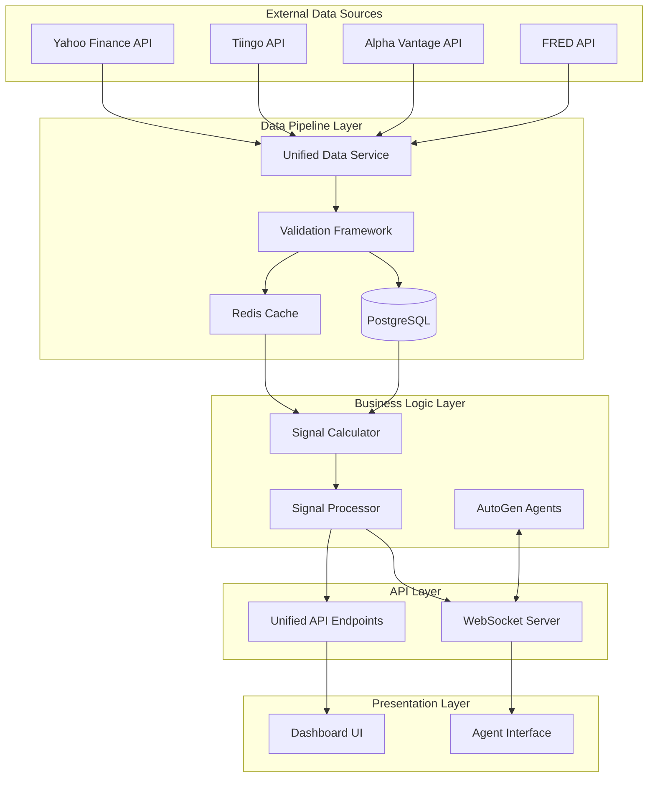

# Data Flow Diagram & State Management

**Version**: 2.0
**Last Updated**: October 31, 2025

## System Data Flow Overview



## Detailed Data Flows

### 1. Market Data Fetching Flow

```
User Request → API Endpoint → Unified Data Service
    ↓
[Check Cache]
    ├─ Hit → Return Cached Data
    └─ Miss → Fetch from Sources
              ↓
        [Primary: Yahoo Finance]
              ├─ Success → Validate
              └─ Failure → Failover
                          ↓
                    [Secondary: Tiingo]
                          ├─ Success → Validate
                          └─ Failure → Failover
                                      ↓
                                [Tertiary: Alpha Vantage]
                                      ├─ Success → Validate
                                      └─ Failure → Return Error
    ↓
[Data Validation]
    ├─ Pass → Store in Cache & DB
    └─ Fail → Log Issues & Degrade Quality
    ↓
[Calculate Signals]
    ↓
[Return Response with Provenance]
```

### 2. Signal Calculation Flow

```
Market Data Input
    ↓
[Quality Assessment]
    ├─ Score > 0.85 → Full Confidence
    ├─ Score 0.70-0.85 → Reduced Confidence
    └─ Score < 0.70 → Warning + Low Confidence
    ↓
[Signal Factory]
    ├─ Utilities/SPY Signal
    ├─ Lumber/Gold Signal
    ├─ Treasury Curve Signal
    ├─ VIX Defensive Signal
    └─ S&P 500 MA Signal
    ↓
[Consensus Calculator]
    ↓
[Persist Results]
    ├─ Signal History Table
    ├─ Provenance Table
    └─ Cache Update
    ↓
[Return with Full Metadata]
```

### 3. Agent Analysis Flow

```
Content Input (Text/URL)
    ↓
[Content Extraction]
    ├─ Text → Direct Processing
    ├─ Substack → Article Extraction
    └─ YouTube → Transcript Extraction
    ↓
[Content Validation]
    ↓
[Fetch Current Signals]
    ↓
[AutoGen Agent Orchestration]
    ├─ Financial Analyst Agent
    ├─ Market Context Agent
    └─ Risk Challenger Agent
    ↓
[Agent Debate via WebSocket]
    ↓
[Consensus Generation]
    ↓
[Store Conversation]
    ↓
[Return Analysis Results]
```

## State Management

### 1. Data States

```typescript
enum DataState {
  FETCHING = 'fetching',
  VALIDATING = 'validating',
  CACHED = 'cached',
  STALE = 'stale',
  ERROR = 'error',
  UNAVAILABLE = 'unavailable'
}

interface DataStateTransition {
  from: DataState;
  to: DataState;
  trigger: string;
  timestamp: Date;
  metadata?: Record<string, any>;
}
```

### 2. Signal States

```typescript
enum SignalState {
  PENDING = 'pending',
  CALCULATING = 'calculating',
  CALCULATED = 'calculated',
  VALIDATED = 'validated',
  PUBLISHED = 'published',
  ARCHIVED = 'archived'
}

interface SignalLifecycle {
  created: Date;
  states: SignalStateTransition[];
  currentState: SignalState;
  confidence: number;
  qualityScore: number;
}
```

### 3. Cache States

```typescript
enum CacheState {
  HOT = 'hot',      // < 60 seconds
  WARM = 'warm',    // 60s - 5 minutes
  COLD = 'cold',    // 5 minutes - 1 hour
  EXPIRED = 'expired',
  INVALIDATED = 'invalidated'
}

interface CacheEntry {
  key: string;
  state: CacheState;
  data: any;
  metadata: {
    created: Date;
    accessed: Date;
    hits: number;
    source: string;
  };
}
```

## Error Propagation Flow

```
Data Source Error
    ↓
[Error Classification]
    ├─ Network Error → Retry with Backoff
    ├─ Rate Limit → Queue for Later
    ├─ Invalid Response → Failover
    └─ Authentication → Alert Admin
    ↓
[Error Recovery]
    ├─ Automatic → Retry/Failover
    ├─ Manual → Admin Intervention
    └─ Graceful → Degrade Service
    ↓
[Error Logging]
    ├─ Console Logs
    ├─ Database Audit
    └─ Monitoring Service
    ↓
[User Notification]
    ├─ Warning Banner
    ├─ Reduced Confidence
    └─ Alternative Options
```

## Data Quality Flow

```
Raw Data Input
    ↓
[Completeness Check]
    ├─ All fields present?
    └─ Required symbols available?
    ↓
[Freshness Check]
    ├─ Is data recent?
    └─ Within acceptable window?
    ↓
[Consistency Check]
    ├─ Values within expected ranges?
    └─ No anomalous patterns?
    ↓
[Accuracy Check]
    ├─ Cross-reference sources
    └─ Validate against known patterns
    ↓
[Quality Score Calculation]
    ├─ Weight each dimension
    └─ Calculate overall score (0-1)
    ↓
[Quality-Based Actions]
    ├─ Score > 0.85 → Proceed normally
    ├─ Score 0.70-0.85 → Add warnings
    └─ Score < 0.70 → Reject or manual review
```

## Provenance Tracking Flow

```
Data Request Initiated
    ↓
[Generate Request ID]
    ↓
[Log Request Metadata]
    ├─ Timestamp
    ├─ User/System ID
    ├─ Requested Symbols
    └─ Options/Parameters
    ↓
[Track Source Selection]
    ├─ Primary/Fallback
    ├─ Source Name
    └─ API Version
    ↓
[Record Fetch Results]
    ├─ Success/Failure
    ├─ Data Points Retrieved
    ├─ Response Time
    └─ Error Messages
    ↓
[Link to Calculations]
    ├─ Signal IDs
    ├─ Calculation Time
    └─ Quality Metrics
    ↓
[Store Provenance Chain]
    └─ Complete Audit Trail
```

## Real-Time Update Flow

```
WebSocket Connection Established
    ↓
[Authentication]
    ├─ Valid Token → Subscribe
    └─ Invalid → Reject
    ↓
[Subscription Management]
    ├─ Market Data Updates
    ├─ Signal Changes
    └─ Agent Conversations
    ↓
[Update Broadcasting]
    ├─ Filter by Subscription
    ├─ Format Message
    └─ Send to Client
    ↓
[Connection Monitoring]
    ├─ Heartbeat Check
    ├─ Error Recovery
    └─ Cleanup on Disconnect
```

## Performance Optimization Flows

### 1. Cache Warming Flow

```
System Startup / Scheduled Job
    ↓
[Identify Hot Data]
    ├─ Most requested symbols
    ├─ Current trading hours
    └─ User preferences
    ↓
[Prefetch Data]
    ├─ Market data for top symbols
    ├─ Recent signal calculations
    └─ Common aggregations
    ↓
[Populate Cache Layers]
    ├─ L1: Current data
    ├─ L2: Recent history
    └─ L3: Reference data
```

### 2. Batch Processing Flow

```
Multiple Requests Detected
    ↓
[Request Aggregation]
    ├─ Group by data source
    ├─ Combine symbol lists
    └─ Merge time ranges
    ↓
[Batch Fetch]
    ├─ Single API call
    └─ Bulk database query
    ↓
[Result Distribution]
    ├─ Split by original request
    ├─ Cache shared data
    └─ Return to requesters
```

## Monitoring & Alerting Flow

```
Continuous Monitoring
    ↓
[Metric Collection]
    ├─ System metrics
    ├─ Business metrics
    └─ Quality metrics
    ↓
[Threshold Evaluation]
    ├─ Normal → Continue
    ├─ Warning → Log
    └─ Critical → Alert
    ↓
[Alert Distribution]
    ├─ Dashboard update
    ├─ Email/SMS
    └─ Incident creation
    ↓
[Response Tracking]
    ├─ Acknowledgment
    ├─ Resolution
    └─ Post-mortem
```

## Data Retention Flow

```
Data Created
    ↓
[Classify Data Type]
    ├─ Market Data → 2 years
    ├─ Signals → 1 year
    ├─ Conversations → 90 days
    └─ Logs → 30 days
    ↓
[Archive Schedule]
    ├─ Hot → Warm (1 day)
    ├─ Warm → Cold (7 days)
    └─ Cold → Archive (30 days)
    ↓
[Cleanup Process]
    ├─ Compress old data
    ├─ Move to cold storage
    └─ Delete expired data
```

## Implementation Priority

### Phase 1: Core Pipeline
1. Unified Data Service
2. Basic Validation
3. PostgreSQL Integration
4. Simple Cache

### Phase 2: Quality & Monitoring
1. Advanced Validation
2. Quality Scoring
3. Monitoring Dashboard
4. Alert System

### Phase 3: Optimization
1. Multi-layer Cache
2. Batch Processing
3. Performance Tuning
4. Load Balancing

### Phase 4: Advanced Features
1. Real-time Updates
2. Machine Learning
3. Predictive Caching
4. Auto-scaling

---

**Note**: This document represents the target state architecture. Implementation will be phased to minimize disruption to existing functionality.