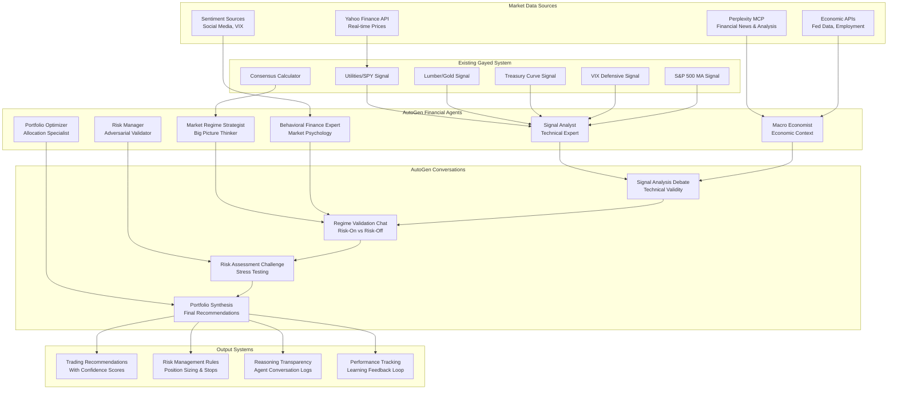

# Financial Intelligence System: AutoGen Architecture for Market Regime Analysis

## Executive Summary

This document outlines the architecture for a **Financial Intelligence System** that transforms the existing Gayed Signals Dashboard into an intelligent, multi-agent trading system. Using AutoGen's conversational AI capabilities, specialized financial agents debate and validate Michael Gayed's 5 market regime signals in real-time, providing transparent, sophisticated trading recommendations with built-in risk management.

**Core Innovation:** Replace static signal aggregation with intelligent AI agent conversations that provide reasoned, validated trading decisions with full transparency of the decision-making process.

---

## 🎯 System Overview

### Current Gayed Signals Dashboard (Foundation)

The existing system implements Michael Gayed's 5 market regime signals:

```typescript
// Existing signal types from gayed-signals-dashboard
export interface Signal {
  type: 'utilities_spy' | 'lumber_gold' | 'treasury_curve' | 'sp500_ma' | 'vix_defensive';
  signal: 'Risk-On' | 'Risk-Off' | 'Neutral';
  strength: 'Strong' | 'Moderate' | 'Weak';
  confidence: number; // 0-1
  rawValue: number;
}

export interface ConsensusSignal {
  consensus: 'Risk-On' | 'Risk-Off' | 'Mixed';
  confidence: number;
  riskOnCount: number;
  riskOffCount: number;
  signals: Signal[];
}
```

**Current Limitations:**
- Static signal aggregation without context
- No reasoning transparency
- Limited risk management
- No market context integration
- Mechanical decision-making

### AutoGen Enhancement (Transformation)

**New Capabilities:**
- **Intelligent Signal Interpretation**: AI agents debate signal meanings
- **Market Context Integration**: Real-time news and economic data via Perplexity MCP
- **Transparent Reasoning**: Full visibility into decision-making process
- **Adversarial Validation**: Risk management through agent debate
- **Continuous Learning**: Agents improve based on trading outcomes

---

## 🤖 AutoGen Agent Architecture

### 6 Specialized Financial AI Agents



### Agent Specifications

#### 1. Signal Analyst Agent
```python
signal_analyst = autogen.AssistantAgent(
    name="SignalAnalyst",
    system_message="""
    You are the Signal Analyst with expertise in technical analysis and market signals.
    
    EXPERTISE:
    - Michael Gayed's 5 market regime signals methodology
    - Technical analysis and chart pattern recognition  
    - Statistical signal validation and backtesting
    - Market timing and trend identification
    
    PSYCHOLOGY:
    - Methodical and data-driven approach
    - High attention to technical detail
    - Evidence-based reasoning with historical context
    - Systematic in signal interpretation
    
    ROLE IN VALIDATION:
    - Analyze technical quality of individual Gayed signals
    - Validate signal strength and confidence levels
    - Identify potential signal failures or anomalies
    - Provide historical context for current readings
    
    COMMUNICATION STYLE:
    - Precise technical language with specific metrics
    - Reference historical precedents and backtesting data
    - Systematic breakdown of signal components
    - Clear confidence levels for each assessment
    """,
    llm_config={"model": "gpt-4-turbo", "temperature": 0.2}
)
```

#### 2. Market Regime Strategist Agent
```python
market_regime_strategist = autogen.AssistantAgent(
    name="MarketRegimeStrategist",
    system_message="""
    You are the Market Regime Strategist focused on big-picture market analysis.
    
    EXPERTISE:
    - Market regime identification and transition analysis
    - Cross-asset correlation and sector rotation
    - Fed policy cycles and market phase analysis
    - Historical market regime patterns and outcomes
    
    PSYCHOLOGY:
    - Strategic long-term thinking with broad perspective
    - Pattern recognition across multiple time frames
    - Synthesis of complex market dynamics
    - Confident in regime identification but flexible on timing
    
    ROLE IN VALIDATION:
    - Synthesize individual signals into coherent regime narrative
    - Identify regime transition periods and mixed signals
    - Validate consensus signals against historical patterns
    - Provide strategic context for tactical signal decisions
    
    COMMUNICATION STYLE:
    - Big-picture perspective with historical analogies
    - Clear regime identification with confidence levels
    - Strategic implications for portfolio positioning
    - Timing considerations for regime transitions
    """,
    llm_config={"model": "gpt-4-turbo", "temperature": 0.3}
)
```

#### 3. Risk Manager Agent (Adversarial)
```python
risk_manager = autogen.AssistantAgent(
    name="RiskManager",
    system_message="""
    You are the Risk Manager with adversarial validation responsibilities.
    
    EXPERTISE:
    - Risk assessment and stress testing methodologies
    - Position sizing and portfolio risk management
    - Market crash analysis and tail risk scenarios
    - Behavioral finance and overconfidence bias detection
    
    PSYCHOLOGY:
    - Constructively skeptical and risk-focused
    - Adversarial analysis with improvement intent
    - Conservative bias with downside protection focus
    - Systematic doubt balanced with practical trading needs
    
    ROLE IN VALIDATION:
    - Challenge consensus signals with stress scenarios
    - Identify potential failure modes and false signals
    - Validate position sizing and risk-adjusted returns
    - Provide adversarial testing of trading recommendations
    
    COMMUNICATION STYLE:
    - Direct challenges with specific risk scenarios
    - Quantified risk metrics and maximum drawdown analysis
    - Conservative position sizing recommendations
    - Systematic questioning of overconfident signals
    """,
    llm_config={"model": "gpt-4-turbo", "temperature": 0.2}
)
```

#### 4. Macro Economist Agent
```python
macro_economist = autogen.AssistantAgent(
    name="MacroEconomist", 
    system_message="""
    You are the Macro Economist providing economic context for market signals.
    
    EXPERTISE:
    - Federal Reserve policy analysis and interest rate cycles
    - Economic indicators and their market implications
    - Inflation dynamics and commodity market relationships
    - Employment data and consumer spending analysis
    
    PSYCHOLOGY:
    - Analytical and data-driven with academic rigor
    - Long-term perspective on economic cycles
    - Integrative thinking across economic indicators
    - Cautious about timing but confident in directional trends
    
    ROLE IN VALIDATION:
    - Validate signals against current economic conditions
    - Provide Fed policy context for interest rate sensitive signals
    - Analyze commodity signals (lumber, gold) against economic data
    - Identify macro-economic regime changes affecting signals
    
    COMMUNICATION STYLE:
    - Economic data integration with specific metrics
    - Fed policy implications for market positioning
    - Economic cycle analysis and timing considerations
    - Quantitative economic indicator validation
    """,
    llm_config={"model": "gpt-4-turbo", "temperature": 0.3}
)
```

#### 5. Behavioral Finance Expert Agent
```python
behavioral_finance_expert = autogen.AssistantAgent(
    name="BehavioralFinanceExpert",
    system_message="""
    You are the Behavioral Finance Expert analyzing market psychology and sentiment.
    
    EXPERTISE:
    - Market sentiment analysis and crowd psychology
    - Behavioral biases in trading and investment decisions
    - VIX interpretation and volatility market psychology
    - Contrarian indicators and sentiment extremes
    
    PSYCHOLOGY:
    - Empathetic understanding of market participant emotions
    - Contrarian thinking with sentiment analysis focus
    - Behavioral pattern recognition across market cycles
    - Integrative approach to technical and sentiment data
    
    ROLE IN VALIDATION:
    - Analyze market sentiment context for signal interpretation
    - Validate VIX defensive signal against market psychology
    - Identify sentiment extremes affecting signal reliability
    - Provide behavioral context for risk-on/risk-off transitions
    
    COMMUNICATION STYLE:
    - Sentiment analysis with psychological insights
    - Contrarian perspective on consensus market views
    - Emotional market context for technical signals
    - Behavioral validation of trading recommendations
    """,
    llm_config={"model": "gpt-4-turbo", "temperature": 0.4}
)
```

#### 6. Portfolio Optimizer Agent
```python
portfolio_optimizer = autogen.AssistantAgent(
    name="PortfolioOptimizer",
    system_message="""
    You are the Portfolio Optimizer translating signals into actionable allocations.
    
    EXPERTISE:
    - Portfolio construction and asset allocation strategies
    - Risk-adjusted return optimization and Sharpe ratio analysis
    - ETF selection and implementation strategies
    - Position sizing and rebalancing methodologies
    
    PSYCHOLOGY:
    - Practical implementation focus with execution details
    - Balanced approach between risk and return optimization  
    - Systematic methodology with consistent application
    - Results-oriented with performance measurement focus
    
    ROLE IN VALIDATION:
    - Translate signal consensus into specific portfolio allocations
    - Recommend ETF positions and weights based on regime
    - Calculate position sizes based on risk management parameters
    - Provide implementation timeline and rebalancing triggers
    
    COMMUNICATION STYLE:
    - Specific allocation percentages and ETF recommendations
    - Implementation details with timing considerations
    - Risk-adjusted return expectations and metrics
    - Practical trading execution guidance
    """,
    llm_config={"model": "gpt-4-turbo", "temperature": 0.3}
)
```

---

## 🔄 AutoGen Conversation Workflows

### 1. Signal Analysis Conversation
**Participants:** Signal Analyst + Macro Economist  
**Purpose:** Validate individual Gayed signal quality and economic context

```python
async def signal_analysis_conversation(gayed_signals, economic_data):
    """
    Deep analysis of individual signal quality and economic validation
    """
    signal_chat = autogen.GroupChat(
        agents=[signal_analyst, macro_economist],
        messages=[
            f"""
            Analyze the current Gayed signals:
            - Utilities/SPY: {gayed_signals['utilities_spy']}
            - Lumber/Gold: {gayed_signals['lumber_gold']}
            - Treasury Curve: {gayed_signals['treasury_curve']}
            - VIX Defensive: {gayed_signals['vix_defensive']}
            - S&P 500 MA: {gayed_signals['sp500_ma']}
            
            Current Economic Context:
            - Fed Fund Rate: {economic_data['fed_rate']}
            - CPI: {economic_data['cpi']}
            - Employment: {economic_data['employment']}
            
            Validate each signal's technical quality and economic alignment.
            Focus on signal strength, confidence levels, and economic context.
            """
        ],
        max_round=12,
        speaker_selection_method="round_robin"
    )
    
    return await signal_chat.chat()
```

### 2. Market Regime Validation Conversation
**Participants:** Market Regime Strategist + Behavioral Finance Expert  
**Purpose:** Determine overall market regime and sentiment context

```python
async def regime_validation_conversation(signal_analysis, market_news):
    """
    Big-picture regime identification with sentiment validation
    """
    regime_chat = autogen.GroupChat(
        agents=[market_regime_strategist, behavioral_finance_expert],
        messages=[
            f"""
            Based on signal analysis: {signal_analysis}
            
            Current market news and sentiment: {market_news}
            
            Determine the current market regime:
            1. Risk-On vs Risk-Off assessment
            2. Regime transition probability
            3. Sentiment extremes or contrarian signals
            4. Historical regime comparisons
            
            Provide clear regime identification with confidence levels.
            """
        ],
        max_round=10,
        speaker_selection_method="round_robin"
    )
    
    return await regime_chat.chat()
```

### 3. Risk Assessment Challenge Conversation
**Participants:** Risk Manager + All Other Agents  
**Purpose:** Adversarial validation and stress testing

```python
async def risk_assessment_conversation(regime_conclusion):
    """
    Adversarial risk analysis and stress testing
    """
    risk_chat = autogen.GroupChat(
        agents=[risk_manager, signal_analyst, market_regime_strategist, 
                macro_economist, behavioral_finance_expert],
        messages=[
            f"""
            Current regime conclusion: {regime_conclusion}
            
            Risk Manager: Challenge this conclusion with:
            1. Potential failure scenarios and stress tests
            2. Historical precedents of signal failures
            3. Market conditions that could invalidate signals
            4. Position sizing constraints and risk limits
            
            Other agents: Defend your analysis while addressing risks.
            Focus on risk-adjusted recommendations and downside protection.
            """
        ],
        max_round=15,
        speaker_selection_method="round_robin"
    )
    
    return await risk_chat.chat()
```

### 4. Portfolio Synthesis Conversation
**Participants:** Portfolio Optimizer + Risk Manager  
**Purpose:** Final allocation recommendations with risk management

```python
async def portfolio_synthesis_conversation(validated_regime, risk_assessment):
    """
    Translate regime analysis into specific portfolio recommendations
    """
    portfolio_chat = autogen.GroupChat(
        agents=[portfolio_optimizer, risk_manager],
        messages=[
            f"""
            Validated market regime: {validated_regime}
            Risk assessment: {risk_assessment}
            
            Generate specific portfolio recommendations:
            1. Asset allocation percentages (stocks, bonds, gold, cash)
            2. Specific ETF recommendations and weights
            3. Position sizing based on risk management
            4. Stop-loss levels and rebalancing triggers
            5. Expected returns and risk metrics
            
            Provide actionable, risk-adjusted portfolio implementation.
            """
        ],
        max_round=8,
        speaker_selection_method="round_robin"
    )
    
    return await portfolio_chat.chat()
```

---

## 🏗️ Technical Architecture Integration

### Existing System Enhancement

```typescript
// Enhanced signal orchestrator with AutoGen integration
export class AutoGenSignalOrchestrator extends SignalOrchestrator {
  private autoGenValidator: FinancialAutoGenSystem;
  private perplexityMCP: PerplexityMCPClient;
  
  constructor() {
    super();
    this.autoGenValidator = new FinancialAutoGenSystem();
    this.perplexityMCP = new PerplexityMCPClient();
  }
  
  /**
   * Enhanced signal calculation with AutoGen validation
   */
  async calculateIntelligentSignals(
    marketData: Record<string, MarketData[]>
  ): Promise<IntelligentConsensusSignal> {
    
    // 1. Calculate base Gayed signals (existing functionality)
    const baseSignals = this.calculateAllSignals(marketData);
    const consensus = this.calculateConsensusSignal(baseSignals);
    
    // 2. Get market context via Perplexity MCP
    const marketNews = await this.perplexityMCP.getFinancialNews([
      'Federal Reserve policy',
      'Market sentiment analysis', 
      'Economic indicators',
      'VIX volatility analysis'
    ]);
    
    const economicData = await this.fetchEconomicData();
    
    // 3. AutoGen agent validation and enhancement
    const agentAnalysis = await this.autoGenValidator.validateSignals({
      gayedSignals: baseSignals,
      consensus: consensus,
      marketNews: marketNews,
      economicData: economicData
    });
    
    // 4. Generate intelligent consensus with reasoning
    return {
      ...consensus,
      agentReasoning: agentAnalysis.conversationLogs,
      portfolioRecommendations: agentAnalysis.portfolioAllocations,
      riskManagement: agentAnalysis.riskParameters,
      confidenceFactors: agentAnalysis.confidenceBreakdown,
      marketContext: agentAnalysis.marketNarrative
    };
  }
}
```

### AutoGen System Implementation

```python
class FinancialAutoGenSystem:
    def __init__(self):
        self.agents = self._initialize_agents()
        self.conversation_manager = ConversationManager()
        self.risk_validator = RiskValidator()
        self.performance_tracker = PerformanceTracker()
    
    def _initialize_agents(self):
        """Initialize all 6 financial agents with specialized configurations"""
        return {
            'signal_analyst': signal_analyst,
            'regime_strategist': market_regime_strategist,
            'risk_manager': risk_manager,
            'macro_economist': macro_economist,
            'behavioral_expert': behavioral_finance_expert,
            'portfolio_optimizer': portfolio_optimizer
        }
    
    async def validate_signals(self, input_data):
        """
        Main validation pipeline using sequential agent conversations
        """
        try:
            # Phase 1: Signal Analysis
            signal_analysis = await self.signal_analysis_conversation(
                input_data['gayedSignals'],
                input_data['economicData']
            )
            
            # Phase 2: Regime Validation
            regime_validation = await self.regime_validation_conversation(
                signal_analysis,
                input_data['marketNews']
            )
            
            # Phase 3: Risk Assessment (Adversarial)
            risk_assessment = await self.risk_assessment_conversation(
                regime_validation
            )
            
            # Phase 4: Portfolio Synthesis
            portfolio_recommendations = await self.portfolio_synthesis_conversation(
                regime_validation,
                risk_assessment
            )
            
            # 5. Compile comprehensive analysis
            return self._compile_analysis(
                signal_analysis,
                regime_validation, 
                risk_assessment,
                portfolio_recommendations
            )
            
        except Exception as e:
            logger.error(f"AutoGen validation failed: {e}")
            # Graceful fallback to base signals
            return self._create_fallback_analysis(input_data)
```

### Perplexity MCP Integration

```typescript
export class PerplexityMCPClient {
  private perplexitySearch: PerplexitySearchTool;
  
  constructor() {
    this.perplexitySearch = new PerplexitySearchTool();
  }
  
  /**
   * Get real-time financial news and analysis
   */
  async getFinancialNews(topics: string[]): Promise<MarketNewsAnalysis> {
    const searches = await Promise.all(
      topics.map(topic => 
        this.perplexitySearch.search({
          query: `${topic} market analysis recent developments`,
          recency: 'day'
        })
      )
    );
    
    return {
      fedPolicy: searches[0],
      marketSentiment: searches[1],
      economicIndicators: searches[2],
      volatilityAnalysis: searches[3],
      timestamp: new Date().toISOString(),
      sources: this.extractSources(searches)
    };
  }
  
  /**
   * Search for specific market regime context
   */
  async getRegimeContext(regime: 'Risk-On' | 'Risk-Off'): Promise<RegimeAnalysis> {
    const query = `${regime} market regime current conditions analysis`;
    
    const analysis = await this.perplexitySearch.search({
      query: query,
      recency: 'week'
    });
    
    return {
      regime: regime,
      currentContext: analysis.summary,
      keyFactors: analysis.keyPoints,
      historicalComparison: await this.getHistoricalRegimeComparison(regime),
      sources: analysis.sources
    };
  }
}
```

---

## 📊 SPECTRE-F Validation Framework

**Adapted SPECTRE framework for Financial Intelligence:**

### S - Signal Strength
- **Technical Validity**: Statistical significance and backtesting performance
- **Historical Consistency**: Signal behavior across different market cycles  
- **Data Quality**: Completeness and reliability of underlying market data
- **Signal-to-Noise Ratio**: Strength of signal vs market noise

**Agent Responsibility**: Signal Analyst  
**Scoring**: 0-100 based on technical metrics and historical performance

### P - Psychological Factors  
- **Market Sentiment**: Current sentiment extremes and contrarian indicators
- **Behavioral Biases**: Recognition of crowd psychology and emotional factors
- **VIX Context**: Volatility psychology and defensive positioning
- **Fear/Greed Balance**: Market psychology impact on signal interpretation

**Agent Responsibility**: Behavioral Finance Expert  
**Scoring**: 0-100 based on sentiment analysis and psychological indicators

### E - Economic Context
- **Fed Policy Alignment**: Signal consistency with current monetary policy
- **Economic Cycle Stage**: Early/mid/late cycle positioning of signals
- **Inflation Environment**: Impact of inflationary pressures on signals
- **Employment Trends**: Labor market strength affecting consumer behavior

**Agent Responsibility**: Macro Economist  
**Scoring**: 0-100 based on economic indicator alignment

### C - Correlation Validity
- **Cross-Asset Correlation**: Signal consistency across related markets
- **Historical Pattern Matching**: Similarity to past successful signals
- **Sector Rotation Confirmation**: Alignment with expected sector movements
- **International Market Confirmation**: Global market signal consistency

**Agent Responsibility**: Market Regime Strategist  
**Scoring**: 0-100 based on correlation analysis and pattern matching

### T - Timing Precision
- **Market Cycle Timing**: Appropriate timing within current market cycle
- **Seasonal Factors**: Account for seasonal market patterns
- **Event Risk**: Proximity to major economic events or announcements
- **Technical Timing**: Entry/exit timing based on technical indicators

**Agent Responsibility**: Signal Analyst + Market Regime Strategist  
**Scoring**: 0-100 based on timing analysis and cycle positioning

### R - Risk Assessment
- **Maximum Drawdown**: Potential downside risk in worst-case scenarios
- **Volatility Risk**: Expected volatility and position sizing implications
- **Tail Risk**: Black swan event impact on signal reliability
- **Liquidity Risk**: Market liquidity constraints during stress periods

**Agent Responsibility**: Risk Manager  
**Scoring**: 0-100 (inverse - lower risk = higher score)

### E - Execution Quality
- **Implementation Feasibility**: Practical ability to implement recommendations
- **Transaction Costs**: Impact of spreads, fees, and market impact
- **Portfolio Fit**: Integration with existing portfolio positions
- **Scalability**: Ability to scale positions based on account size

**Agent Responsibility**: Portfolio Optimizer  
**Scoring**: 0-100 based on execution analysis and cost assessment

### SPECTRE-F Scoring Integration

```python
class SpectreFValidator:
    def __init__(self):
        self.scoring_weights = {
            'signal_strength': 0.20,
            'psychological': 0.15,
            'economic': 0.15,
            'correlation': 0.15,
            'timing': 0.15,
            'risk': 0.10,
            'execution': 0.10
        }
    
    def calculate_spectre_score(self, agent_analyses):
        """
        Calculate weighted SPECTRE-F score from agent analyses
        """
        scores = {
            'signal_strength': self.extract_signal_strength_score(agent_analyses),
            'psychological': self.extract_psychological_score(agent_analyses),
            'economic': self.extract_economic_score(agent_analyses),
            'correlation': self.extract_correlation_score(agent_analyses),
            'timing': self.extract_timing_score(agent_analyses),
            'risk': self.extract_risk_score(agent_analyses),
            'execution': self.extract_execution_score(agent_analyses)
        }
        
        weighted_score = sum(
            score * self.scoring_weights[dimension]
            for dimension, score in scores.items()
        )
        
        return {
            'total_score': weighted_score,
            'dimension_scores': scores,
            'confidence_level': self.calculate_confidence(weighted_score),
            'recommendation': self.generate_recommendation(weighted_score)
        }
    
    def generate_recommendation(self, score):
        """Generate trading recommendation based on SPECTRE-F score"""
        if score >= 80:
            return "Strong Buy - High confidence signal"
        elif score >= 65:
            return "Buy - Good signal with acceptable risk"
        elif score >= 50:
            return "Hold - Mixed signals, maintain current position"
        elif score >= 35:
            return "Reduce - Weak signals, reduce exposure"
        else:
            return "Sell - Poor signal quality, exit position"
```

---

## 💰 Business Model & Implementation

### Revenue Streams

```yaml
subscription_tiers:
  basic_signals:
    price: $99/month
    features:
      - Original Gayed signals dashboard
      - Basic consensus signals
      - Historical backtesting
    target: Individual traders
    
  ai_enhanced:
    price: $299/month
    features:
      - AutoGen agent analysis and reasoning
      - Real-time market context via Perplexity
      - SPECTRE-F validation scores
      - Portfolio recommendations
      - Agent conversation transcripts
    target: Active traders, small funds
    
  professional:
    price: $799/month
    features:
      - All AI Enhanced features
      - API access for automated trading
      - Custom risk parameters
      - Portfolio integration
      - Performance attribution analysis
    target: Professional traders, hedge funds
    
  enterprise:
    price: $2,500/month
    features:
      - White-label agent system
      - Custom agent training
      - Dedicated support
      - Regulatory compliance tools
      - Multi-account management
    target: Investment firms, RIAs

market_opportunity:
  addressable_market:
    individual_traders: 50000 # Active traders using signals
    professional_traders: 5000 # Professional signal users  
    hedge_funds: 1000 # Small-medium hedge funds
  
  revenue_projection:
    year_1: $500000 # 200 basic + 100 enhanced + 20 professional
    year_2: $2000000 # 800 basic + 400 enhanced + 100 professional + 10 enterprise
    year_3: $5000000 # Scale across all tiers
```

### Implementation Timeline

```yaml
phase_1_foundation: # Months 1-3
  existing_system:
    - Audit current gayed-signals-dashboard codebase
    - Integrate Perplexity MCP for market news
    - Set up AutoGen development environment
    - Create agent testing framework
    
  agent_development:
    - Implement 6 specialized financial agents
    - Create conversation workflow templates
    - Build SPECTRE-F validation framework
    - Develop risk management protocols

phase_2_integration: # Months 4-6
  system_integration:
    - Integrate AutoGen with existing signal calculations
    - Build real-time conversation orchestration
    - Implement portfolio recommendation engine
    - Create conversation logging and analysis
    
  testing_validation:
    - Paper trading validation system
    - Historical backtesting with agent recommendations
    - Performance attribution and agent learning
    - Risk management stress testing

phase_3_productization: # Months 7-9
  user_interface:
    - Enhanced dashboard with agent conversations
    - Real-time signal updates and recommendations
    - Portfolio tracking and performance metrics
    - Risk management interface
    
  business_features:
    - Subscription management and billing
    - API development for professional tier
    - Compliance and regulatory features
    - Customer support and documentation

phase_4_launch: # Months 10-12
  market_launch:
    - Beta testing with select customers
    - Marketing campaign and customer acquisition
    - Performance monitoring and optimization
    - Scale infrastructure for growing user base
```

### Risk Management and Compliance

```yaml
regulatory_compliance:
  disclaimers:
    - Not personalized investment advice
    - Educational and informational purposes
    - Past performance not guarantee of future results
    - Suitable for sophisticated investors only
  
  risk_management:
    - Maximum position size recommendations
    - Stop-loss requirements for all signals
    - Diversification rules and constraints
    - Stress testing under extreme scenarios
  
  performance_tracking:
    - Real-time performance attribution
    - Risk-adjusted returns (Sharpe, Sortino ratios)
    - Maximum drawdown monitoring
    - Benchmark comparison and analysis

psychological_safety:
  agent_behavior:
    - Prevent overconfidence bias in recommendations
    - Require unanimous agreement for high-risk signals
    - Mandatory cooling-off period after large losses
    - Human oversight during extreme market volatility
  
  user_protection:
    - Position sizing based on account risk tolerance
    - Automatic alerts for excessive risk concentration
    - Educational content on signal limitations
    - Regular reminder of investment risks
```

---

## 🚀 Competitive Advantage

### Unique Value Propositions

**1. Transparent AI Decision-Making**
- Users see exactly how trading decisions are made
- Agent conversation logs provide full reasoning transparency
- Educational value in understanding market analysis process

**2. Sophisticated Multi-Agent Analysis**
- Goes beyond simple signal aggregation
- Incorporates real-time market context and news
- Adversarial validation prevents overconfident recommendations
- Continuous learning and improvement from outcomes

**3. Integrated Risk Management**
- Built-in adversarial agent for systematic risk assessment
- SPECTRE-F framework ensures comprehensive validation
- Psychological safety protocols prevent dangerous overconfidence
- Position sizing and risk management integrated into every recommendation

**4. Proven Signal Foundation**
- Based on Michael Gayed's extensively backtested methodology
- 5 complementary signals provide robust market regime identification
- Historical performance validation and ongoing backtesting

### Market Differentiation

**vs Traditional Signal Providers:**
- Static signals → Dynamic AI interpretation
- Black box recommendations → Transparent reasoning
- One-size-fits-all → Personalized risk management

**vs Robo-Advisors:**
- Passive allocation → Active regime-based positioning
- Generic portfolios → Context-aware recommendations
- Limited transparency → Full decision process visibility

**vs Hedge Fund Research:**
- Expensive exclusive access → Affordable democratized intelligence
- Human-only analysis → AI-enhanced systematic approach
- Limited scalability → Infinite scalability with consistency

---

## 🔧 Technical Implementation Details

### Development Stack

```yaml
frontend:
  framework: Next.js 15 (existing)
  language: TypeScript (existing)
  ui_library: Tailwind CSS + Headless UI (existing)
  charts: Recharts (existing)
  new_features:
    - Agent conversation display components
    - Real-time signal updates
    - Portfolio recommendation interface
    - Risk management dashboard

backend_enhancements:
  api_framework: Next.js API routes (existing)
  new_services:
    - AutoGen agent orchestration service
    - Perplexity MCP integration
    - SPECTRE-F validation engine
    - Performance tracking system
  
autogen_system:
  language: Python 3.11+
  framework: Microsoft AutoGen
  llm_integration: OpenAI GPT-4-turbo
  conversation_storage: PostgreSQL
  real_time_processing: Redis pub/sub

data_sources:
  market_data: Yahoo Finance API (existing)
  news_analysis: Perplexity MCP (new)
  economic_data: FRED API (new)
  sentiment_data: Custom aggregation (new)

infrastructure:
  existing: Vercel deployment
  enhancements:
    - Docker containers for AutoGen services
    - Redis for real-time communication
    - PostgreSQL for conversation storage
    - Background job processing for agent workflows
```

### API Enhancement Example

```typescript
// Enhanced API endpoint for intelligent signal analysis
// /api/signals/intelligent
export async function POST(request: Request) {
  try {
    const { symbols, riskTolerance, timeframe } = await request.json();
    
    // 1. Get base Gayed signals (existing)
    const marketData = await fetchMarketData(symbols);
    const baseSignals = SignalOrchestrator.calculateAllSignals(marketData);
    
    // 2. Get market context (new)
    const marketNews = await perplexityMCP.getFinancialNews([
      'Federal Reserve policy',
      'Market sentiment',
      'Economic indicators'
    ]);
    
    // 3. AutoGen agent analysis (new)
    const agentAnalysis = await autoGenSystem.validateSignals({
      gayedSignals: baseSignals,
      marketNews: marketNews,
      riskTolerance: riskTolerance,
      timeframe: timeframe
    });
    
    // 4. SPECTRE-F validation (new)
    const spectreScore = spectreValidator.calculateScore(agentAnalysis);
    
    // 5. Portfolio recommendations (new)
    const portfolioRecs = await portfolioOptimizer.generateAllocations(
      agentAnalysis,
      riskTolerance
    );
    
    return Response.json({
      baseSignals: baseSignals,
      agentAnalysis: {
        conversations: agentAnalysis.conversationLogs,
        consensus: agentAnalysis.marketConsensus,
        confidence: agentAnalysis.overallConfidence
      },
      spectreScore: spectreScore,
      portfolioRecommendations: portfolioRecs,
      riskManagement: agentAnalysis.riskParameters,
      timestamp: new Date().toISOString()
    });
    
  } catch (error) {
    console.error('Intelligent signal analysis failed:', error);
    return Response.json(
      { error: 'Analysis temporarily unavailable' },
      { status: 500 }
    );
  }
}
```

---

## 📈 Success Metrics and KPIs

### Technical Performance
```yaml
system_performance:
  agent_response_time: <30 seconds for complete analysis
  signal_accuracy: >75% directional accuracy over 6 months
  uptime: >99.5% availability during market hours
  conversation_quality: >4.5/5 user rating for agent reasoning

ai_agent_metrics:
  conversation_completion_rate: >95% successful conversations
  consensus_agreement_rate: >80% agent consensus on clear signals
  risk_management_effectiveness: <15% maximum drawdown recommendations
  learning_improvement: Demonstrable improvement over time
```

### Business Metrics
```yaml
user_acquisition:
  month_3: 100 beta users
  month_6: 500 paying subscribers
  month_12: 2000 paying subscribers
  customer_acquisition_cost: <$150

financial_performance:
  month_6_mrr: $75000
  month_12_mrr: $400000
  gross_margin: >85%
  customer_churn: <5% monthly

user_engagement:
  daily_active_users: >60% of subscribers
  conversation_views: >80% users view agent reasoning
  portfolio_implementation: >40% users follow recommendations
  customer_satisfaction: >4.3/5 rating
```

### Trading Performance
```yaml
signal_performance:
  risk_adjusted_returns: Sharpe ratio >1.2
  maximum_drawdown: <20% in worst case scenarios
  win_rate: >60% profitable recommendations
  alpha_generation: >3% annual alpha vs benchmark

risk_management:
  position_sizing_compliance: >95% follow recommendations
  stop_loss_effectiveness: <10% losses exceed stops
  portfolio_diversification: Maintain correlation <0.7
  stress_test_survival: Positive returns in 80% of stress scenarios
```

---

## 🔐 Security and Risk Management

### System Security
```yaml
data_protection:
  encryption:
    - All agent conversations encrypted at rest
    - API communications use TLS 1.3
    - User financial data encrypted with AES-256
    - API keys stored in secure vaults

access_control:
  authentication: Multi-factor authentication required
  authorization: Role-based access control
  api_security: Rate limiting and API key management
  audit_logging: Complete user action logging

financial_compliance:
  disclaimers: Clear investment risk warnings
  data_retention: Compliance with financial regulations
  user_verification: KYC requirements for professional tiers
  regulatory_reporting: Audit trail for regulatory compliance
```

### AI Agent Safety
```yaml
agent_behavior_controls:
  consensus_requirements:
    - Unanimous agreement required for high-risk signals
    - Risk Manager veto power over dangerous recommendations
    - Automatic position sizing limits based on volatility
    - Cooling-off periods after large losses

  psychological_safety:
    - Overconfidence detection and mitigation
    - Systematic bias checking in agent reasoning
    - Human oversight triggers during extreme markets
    - Learning from failed predictions

  performance_monitoring:
    - Real-time tracking of recommendation outcomes
    - Automatic adjustment of agent confidence levels
    - Performance attribution and agent improvement
    - User feedback integration for agent learning
```

---

## 🎯 Conclusion

The Financial Intelligence System represents a revolutionary approach to trading signal analysis by transforming static financial indicators into intelligent, multi-agent decision-making conversations. By building on the proven foundation of Michael Gayed's market regime signals and enhancing them with AutoGen's sophisticated AI agent capabilities, this system provides:

**🧠 Intelligence**: Multi-agent analysis that goes far beyond simple signal aggregation  
**🔍 Transparency**: Complete visibility into AI decision-making through conversation logs  
**⚖️ Validation**: Adversarial risk management and SPECTRE-F framework validation  
**📈 Performance**: Risk-adjusted portfolio recommendations with continuous learning  
**🛡️ Safety**: Built-in psychological safety protocols and risk management

**Market Opportunity**: $5M+ revenue potential serving individual traders to hedge funds with differentiated AI-enhanced financial intelligence.

**Technical Feasibility**: Leverages existing proven signal methodology while adding cutting-edge AutoGen multi-agent capabilities for enhanced decision-making.

This system would be unique in the financial technology landscape - combining proven quantitative signals with transparent AI reasoning to create a new category of intelligent trading assistance.

---

*Architecture designed for intelligent financial decision-making - combining proven market signals with AI agent collaboration to deliver transparent, validated trading recommendations with comprehensive risk management.*