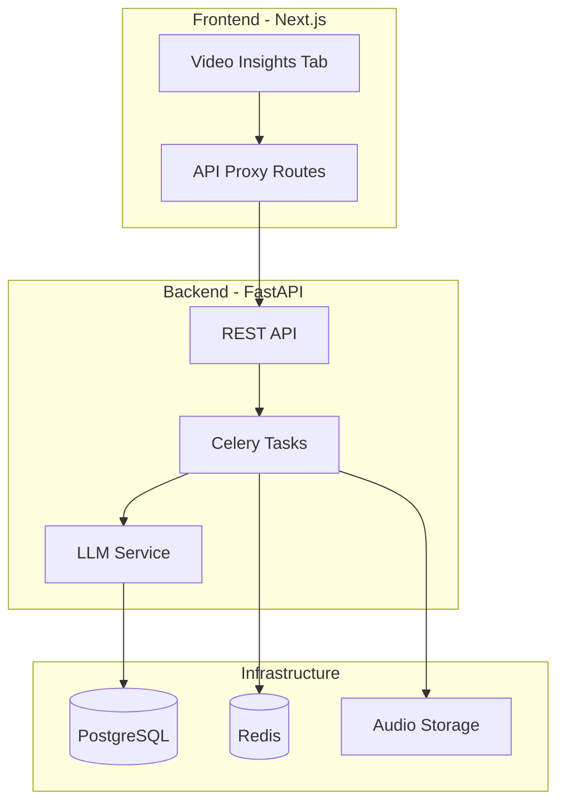

# Feature PRD: YouTube Summary Tab

**The task abruptly quit in the middle of the completion of it. I want you to look at all the files in the git, they were made to solve this task**

## 1 Context

The existing trading signals dashboard needs enhanced knowledge management capabilities. Users currently analyze market signals but lack tools to extract insights from video content. YouTube contains valuable financial analysis, market commentary, and educational content that users need to process efficiently. Manual transcription and note-taking is time-consuming and prevents users from leveraging video-based market intelligence at scale.

## 2 Goals / Non-Goals

- **G1** Enable users to extract structured knowledge from YouTube videos through automated transcription and AI summarization
- **G2** Provide persistent storage and organization of video insights with folder-based management
- **G3** Support multi-user architecture with proper data isolation and authentication
- **G4** Deliver processing within 2-4 minutes for videos under 20 minutes
- **G5** Create modular LLM integration allowing easy provider switching (GPT-4, Claude, etc.)

- **NG1** Not building a video hosting platform - only processing YouTube URLs
- **NG2** Not implementing real-time transcription - batch processing is acceptable
- **NG3** Not supporting video formats beyond YouTube initially
- **NG4** Not building custom authentication - will integrate with existing system

## 3 Potential Solutions

| Option | Pros | Cons | Verdict |
| ------ | ---- | ---- | ------- |
| Monolithic Next.js with API Routes | Single codebase, simpler deployment, TypeScript throughout | Limited scalability for AI workloads, harder to optimize Python AI libraries | ❌ |
| Next.js + FastAPI Microservice | Optimal language for each component, better scalability, clean separation | More complex deployment, requires CORS/auth coordination | ✅ |
| Serverless Functions (Vercel/AWS Lambda) | Auto-scaling, pay-per-use, no infrastructure management | Cold starts, 15-min timeout limits, complex local development | ❌ |

## 4 Recommended Solution

**Chosen option:** Next.js + FastAPI Microservice

### 4.1 High-level Overview

A new "Video Insights" tab in the Next.js dashboard connects to a FastAPI backend service. The backend handles YouTube video processing through an async task queue (Celery + Redis), transcribes audio using OpenAI Whisper API, and generates summaries via modular LLM integration. PostgreSQL stores all data with user isolation via Row Level Security.



### 4.2 File/Module Impact

**Frontend (Next.js):**
- `app/video-insights/page.tsx` - Main tab component
- `app/video-insights/layout.tsx` - Tab layout with navigation
- `components/video-insights/VideoInput.tsx` - URL input component
- `components/video-insights/TranscriptViewer.tsx` - Transcript display with timestamps
- `components/video-insights/SummaryPanel.tsx` - Summary display with modes
- `components/video-insights/FolderSidebar.tsx` - Folder management
- `lib/api/video-insights.ts` - API client for backend communication
- `app/api/video-insights/[...path]/route.ts` - Proxy route to FastAPI

**Backend (FastAPI):**
- `backend/main.py` - FastAPI app initialization
- `backend/api/routes/videos.py` - Video processing endpoints
- `backend/api/routes/folders.py` - Folder management endpoints
- `backend/services/youtube_service.py` - yt-dlp integration
- `backend/services/transcription_service.py` - Whisper API integration
- `backend/services/llm_service.py` - Modular LLM integration
- `backend/tasks/video_tasks.py` - Celery background tasks
- `backend/models/database.py` - SQLAlchemy models
- `backend/core/security.py` - JWT authentication
- `backend/db/init_db.py` - Database initialization script

### 4.3 APIs / Interfaces

```typescript
// Frontend Types (lib/types/video-insights.ts)
interface VideoSummaryRequest {
  youtube_url: string;
  user_prompt?: string;
  summary_mode: 'bullet' | 'executive' | 'action_items' | 'timeline' | 'custom';
  folder_id?: string;
}

interface Video {
  id: string;
  user_id: string;
  folder_id?: string;
  youtube_url: string;
  title: string;
  channel_name: string;
  duration: number; // seconds
  published_at: string;
  status: 'processing' | 'complete' | 'error';
  created_at: string;
}

interface Transcript {
  id: string;
  video_id: string;
  full_text: string;
  chunks: TranscriptChunk[];
}

interface TranscriptChunk {
  start_time: number;
  end_time: number;
  text: string;
}

interface Summary {
  id: string;
  video_id: string;
  user_prompt?: string;
  summary_text: string;
  mode: string;
  created_at: string;
}
```

```python
# Backend API Routes (FastAPI)
@router.post("/api/v1/videos/summarize")
async def create_video_summary(
    request: VideoSummaryRequest,
    current_user: User = Depends(get_current_user),
    db: AsyncSession = Depends(get_db)
) -> VideoSummaryResponse:
    """Queue video for processing"""

@router.get("/api/v1/videos/{video_id}")
async def get_video_details(
    video_id: UUID,
    current_user: User = Depends(get_current_user),
    db: AsyncSession = Depends(get_db)
) -> VideoDetails:
    """Get video with transcript and summaries"""

@router.get("/api/v1/videos")
async def list_user_videos(
    folder_id: Optional[UUID] = None,
    search: Optional[str] = None,
    current_user: User = Depends(get_current_user),
    db: AsyncSession = Depends(get_db)
) -> List[Video]:
    """List videos with optional filtering"""

@router.post("/api/v1/folders")
async def create_folder(
    name: str,
    current_user: User = Depends(get_current_user),
    db: AsyncSession = Depends(get_db)
) -> Folder:
    """Create new folder"""
```

## Trade-offs & Rationale

The microservice architecture with FastAPI backend provides optimal separation of concerns:

- **Python for AI workloads**: Native support for yt-dlp, Whisper API, and LLM libraries
- **Async task processing**: Celery + Redis prevents API timeouts for long videos
- **PostgreSQL with RLS**: Enterprise-grade security with built-in user isolation
- **Modular LLM service**: Easy switching between providers without code changes

Complexity trade-offs:
- Requires coordinating two services (Next.js + FastAPI)
- CORS and authentication setup needed
- More complex local development environment

These are acceptable given the performance and scalability benefits.

# Section 5: Prompt Management System
The design document includes a comprehensive Section 5: Prompt Management System with:

## 5.1 Overview
Custom prompts for tailored video summarization
Pre-built templates for different use cases
Variable substitution system
## 5.2 Database Schema Extensions
-- Prompt templates table
CREATE TABLE prompt_templates (
    id UUID PRIMARY KEY DEFAULT gen_random_uuid(),
    user_id UUID REFERENCES users(id) ON DELETE CASCADE,
    name VARCHAR(255) NOT NULL,
    description TEXT,
    prompt_text TEXT NOT NULL,
    category VARCHAR(100) DEFAULT 'custom',
    is_public BOOLEAN DEFAULT FALSE,
    variables JSONB DEFAULT '[]',
    usage_count INTEGER DEFAULT 0,
    created_at TIMESTAMP WITH TIME ZONE DEFAULT NOW()
);

## 5.3 API Endpoints
GET /api/v1/prompts/templates - List templates with filtering
POST /api/v1/prompts/templates - Create new template
POST /api/v1/prompts/templates/{id}/preview - Preview with video metadata
POST /api/v1/prompts/validate - Validate prompt syntax

## 5.4 Frontend Components
PromptEditor - Monaco editor with variable insertion buttons
TemplateSelector - Categorized template browsing
Real-time validation and preview functionality

## 5.5 Pre-built Templates
Financial Analysis - Investment insights, market analysis, actionable takeaways
Technical Tutorial - Learning objectives, step-by-step process, resources
Meeting/Interview - Participants, decisions, action items, quotes

## 5.6 Prompt Processing Service
Variable extraction and substitution using Jinja2
Syntax validation with error/warning feedback
Improvement suggestions for better prompts
The system allows users to: ✅ Create custom prompts with variables like {video_title}, {channel_name}, {duration} ✅ Save and reuse successful prompt templates ✅ Browse pre-built templates for common use cases ✅ Preview how prompts will render with actual video data ✅ Get real-time validation and improvement suggestions

## 6 Implementation Plan

**Phase 1: Infrastructure Setup (Week 1)**
1. Create FastAPI project structure with async SQLAlchemy
2. Set up PostgreSQL database with UUID primary keys
3. Implement database initialization script (`backend/db/init_db.py`)
4. Configure Celery + Redis for task queue
5. Set up CORS and JWT authentication

**Phase 2: Core Processing Pipeline (Week 2)**
1. Implement yt-dlp service for audio extraction
2. Create Whisper API integration with chunking for long audio
3. Build modular LLM service with provider abstraction
4. Implement Celery tasks for async processing
5. Add progress tracking and error handling

**Phase 3: Frontend Integration (Week 3)**
1. Create Video Insights tab in Next.js dashboard
2. Build VideoInput component with URL validation
3. Implement TranscriptViewer with timestamp navigation
4. Create SummaryPanel with mode selection
5. Add FolderSidebar for organization

**Phase 4: Search & Polish (Week 4)**
1. Implement full-text search across transcripts/summaries
2. Add batch processing for playlists
3. Create export functionality (Markdown/PDF)
4. Performance optimization and testing
5. Documentation and deployment guides

## 7 Performance Optimization & Memory Efficiency

### 7.1 Audio Processing Optimizations

**Streaming Audio Extraction:**
```python
# backend/services/youtube_service.py
def extract_audio_optimized(youtube_url: str) -> str:
    """Extract audio with memory-efficient streaming"""
    ydl_opts = {
        'format': 'bestaudio[ext=m4a]/bestaudio',  # Prefer m4a for smaller size
        'outtmpl': 'temp/%(id)s.%(ext)s',
        'postprocessors': [{
            'key': 'FFmpegExtractAudio',
            'preferredcodec': 'mp3',
            'preferredquality': '128',  # Optimize for transcription, not music quality
        }],
        'writeinfojson': False,  # Skip metadata files
        'writethumbnail': False,  # Skip thumbnails
        'quiet': True,
        'no_warnings': True,
    }
    
    with yt_dlp.YoutubeDL(ydl_opts) as ydl:
        info = ydl.extract_info(youtube_url, download=True)
        return f"temp/{info['id']}.mp3"
```

**Memory-Efficient Audio Chunking:**
```python
# backend/services/transcription_service.py
async def chunk_audio_streaming(audio_path: str, chunk_size_mb: int = 20) -> AsyncGenerator[str, None]:
    """Stream audio chunks without loading entire file into memory"""
    # Calculate optimal chunk duration based on file size
    file_size_mb = os.path.getsize(audio_path) / (1024 * 1024)
    total_duration = get_audio_duration(audio_path)
    num_chunks = max(1, int(file_size_mb / chunk_size_mb))
    chunk_duration = total_duration / num_chunks
    
    for i in range(num_chunks):
        start_time = i * chunk_duration
        chunk_path = f"temp/chunk_{uuid.uuid4()}.mp3"
        
        # Use ffmpeg streaming to avoid memory spikes
        process = await asyncio.create_subprocess_exec(
            'ffmpeg', '-i', audio_path, 
            '-ss', str(start_time), 
            '-t', str(chunk_duration), 
            '-acodec', 'mp3', 
            '-ar', '16000',  # Whisper optimal sample rate
            '-ac', '1',      # Mono audio
            '-b:a', '64k',   # Lower bitrate for speech
            chunk_path, '-y',
            stdout=asyncio.subprocess.DEVNULL,
            stderr=asyncio.subprocess.DEVNULL
        )
        await process.wait()
        
        yield chunk_path
        
        # Cleanup immediately after processing
        await asyncio.sleep(0.1)  # Allow I/O to complete
        os.unlink(chunk_path)
```

### 7.2 Database Performance

**Indexed Search Performance:**
```sql
-- backend/db/migrations/002_performance_indexes.sql
-- Indexes for fast search and retrieval
CREATE INDEX CONCURRENTLY idx_videos_user_status 
    ON videos(user_id, status) 
    WHERE status != 'error';

CREATE INDEX CONCURRENTLY idx_videos_folder_created 
    ON videos(user_id, folder_id, created_at DESC);

-- Full-text search indexes
CREATE INDEX CONCURRENTLY idx_transcripts_search 
    ON transcripts USING gin(to_tsvector('english', full_text));

CREATE INDEX CONCURRENTLY idx_summaries_search 
    ON summaries USING gin(to_tsvector('english', summary_text));

-- Metadata search
CREATE INDEX CONCURRENTLY idx_videos_title_channel 
    ON videos USING gin(to_tsvector('english', title || ' ' || channel_name));

-- Temporal indexes
CREATE INDEX CONCURRENTLY idx_videos_created_at 
    ON videos(created_at DESC);

CREATE INDEX CONCURRENTLY idx_folders_user_id 
    ON folders(user_id);
```

**Connection Pooling:**
```python
# backend/core/database.py
from sqlalchemy.ext.asyncio import create_async_engine, AsyncSession
from sqlalchemy.pool import NullPool, QueuePool
import os

# Determine pool class based on environment
if os.getenv("ENVIRONMENT") == "production":
    poolclass = QueuePool
    pool_kwargs = {
        "pool_size": 10,          # Base connections
        "max_overflow": 20,       # Additional connections under load
        "pool_timeout": 30,       # Timeout for getting connection
        "pool_recycle": 3600,     # Recycle connections hourly
        "pool_pre_ping": True,    # Validate connections
    }
else:
    poolclass = NullPool  # No pooling in development
    pool_kwargs = {}

engine = create_async_engine(
    DATABASE_URL,
    poolclass=poolclass,
    echo=False,  # Disable SQL logging in production
    **pool_kwargs
)

# Session factory with optimized settings
async_session_maker = sessionmaker(
    engine,
    class_=AsyncSession,
    expire_on_commit=False,
    autoflush=False,  # Manual flush for better control
)
```

### 7.3 Caching Strategy

**Redis Caching Layers:**
```python
# backend/services/cache_service.py
import redis.asyncio as redis
import hashlib
import json
from typing import Optional, Dict, List
from datetime import timedelta

class CacheService:
    def __init__(self):
        self.redis = redis.Redis(
            host='localhost', 
            port=6379, 
            db=1,
            decode_responses=True,
            max_connections=50
        )
    
    async def cache_video_metadata(self, youtube_url: str, metadata: dict) -> None:
        """Cache video metadata to avoid repeated yt-dlp calls"""
        cache_key = f"video_meta:{hashlib.md5(youtube_url.encode()).hexdigest()}"
        await self.redis.setex(
            cache_key, 
            timedelta(days=7),  # 7 day TTL for metadata
            json.dumps(metadata)
        )
    
    async def get_video_metadata(self, youtube_url: str) -> Optional[dict]:
        """Retrieve cached video metadata"""
        cache_key = f"video_meta:{hashlib.md5(youtube_url.encode()).hexdigest()}"
        data = await self.redis.get(cache_key)
        return json.loads(data) if data else None
    
    async def cache_transcript_chunks(self, video_id: str, chunks: List[dict]) -> None:
        """Cache processed transcript chunks with compression"""
        cache_key = f"transcript_chunks:{video_id}"
        # Use Redis list for streaming chunks
        pipeline = self.redis.pipeline()
        for chunk in chunks:
            pipeline.rpush(cache_key, json.dumps(chunk))
        pipeline.expire(cache_key, timedelta(hours=1))
        await pipeline.execute()
    
    async def invalidate_user_cache(self, user_id: str) -> None:
        """Invalidate all caches for a user"""
        pattern = f"user:{user_id}:*"
        async for key in self.redis.scan_iter(match=pattern):
            await self.